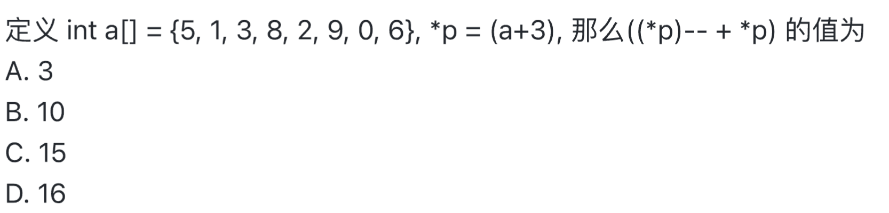

#
1. (c3)16 -> 1. 根据位值原理转为10进制 2. 16进制转2进制， 1位转4位， 不够的补1
2. 两个条件同时成立的相反是至少有一个条件不成立，在该例子中，！表示取反，所以我们只要看是否有条件满足两个条件同时成立的对立面https://zh.wikipedia.org/wiki/%E5%BE%B7%E6%91%A9%E6%A0%B9%E5%AE%9A%E5%BE%8B
3. 使用char a[] = "SOME THING"定义的是字符串，不是普通的字符串数组， 所以要加上'\0'，所以应该是字符数加一，空格和特殊字符也要算进去。
4.  