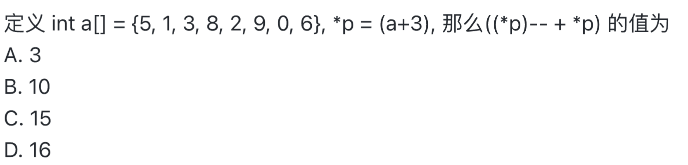

# 复习要点
## C++程序设计
1. 基本数据类型,数学库常用函数 (往期学案/C++基础/0基础知识_数学库函数_数据类型_类型转换.pdf)
2. 一位数组及常量 （往期学案/C++基础/03一维数组及常量.pdf）
3. 二维数组 （往期学案/C++基础/cpp22二维数组.pdf）
3. 结构体和类（往期学案/C++基础/04结构体.pdf 05类pdf）
4. 字符数组_字符串_string (往期学案/C++基础/02字符数组进制转换及指针.pdf string.pdf)
5. 函数与递归 (往期学案/C++基础/01函数.pdf)
6. 程序基本结构(往期学案/C++基础/循环结构.pdf)

## 基本数据结构
1. 线性表（链表，队列，栈）（往期学案/基本数据结构/14，15，16，17，18）
2. 简单树，树的定义及相关概念 （往期学案/基本数据结构/21,22）
3. 简单图，图的定义及相关概念，图的邻接表存储和邻接矩阵存储（往期学案/）

## 基本算法（对照往期学案以及题库复习）
1. 枚举法 （往期学案/算法/）
2. 模拟法  
3. 贪心法 （往期学案/算法/10）
4. 递推法  (往期学案/算法/11)
5. 递归法  (往期学案/算法/12)
6. 排序算法（插入排序，冒泡排序，选择排序） (往期学案/算法/6,7)
7. 高精度算法 (往期学案/算法/8，9)
8. 搜索算法 (往期学案/算法/19 20)
## 数学
1. 数的进制及转化，十进制转r进制（除基取余法） r进制转10进制（位值定理）
2. 整除，求余
3. 因数倍数，辗转相除法求最大公因数，短除法求最小公倍数
4. 指数
5. 质数合数
6. 唯一分解定理
#  
1. (c3)16 -> 1. 根据位值原理转为10进制 2. 16进制转2进制， 1位转4位， 不够的补1
2. 两个条件同时成立的相反是至少有一个条件不成立，在该例子中，！表示取反，所以我们只要看是否有条件满足两个条件同时成立的对立面https://zh.wikipedia.org/wiki/%E5%BE%B7%E6%91%A9%E6%A0%B9%E5%AE%9A%E5%BE%8B
3. 使用char a[] = "SOME THING"定义的是字符串，不是普通的字符串数组， 所以要加上'\0'，所以应该是字符数加一，空格和特殊字符也要算进去。
4. 
5. 什么是ACM模式什么是核心代码模式？ ACM模式是指：题目不给任何辅助代码，所有的输入输出需要自己构造，而核心代码模式是指，只需要专注算法的实现部分，而程序的输入和输出代码程序自动帮忙完成。