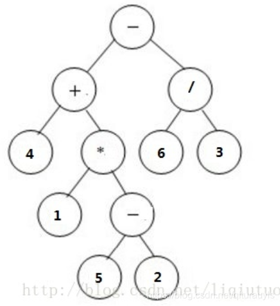
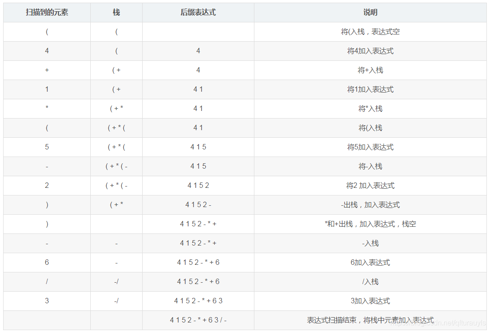

# 表达式树与前缀，中缀，后缀表达式
计算机科学中，除了栈以外，二叉树也是处理表达式的常用工具，为了处理表达式而遵循相应规则构造的树被称为表达式树

## 表达式树
算数表达式是分层的递归结构，一个运算符作用于相应的运算对象，其运算对象又可以是任意复杂的表达式。树的递归结构正好用来表示这种表达式。下面只讨论二元表达式。二元表达式可以很自然的联系到二叉树：以基本运算对象作为叶节点中的数据；以运算符作为非叶节点中的数据，其两棵子树是它的运算对象，子树可以是基本运算对象，也可以是复杂表达式。如图是一个表达式树。

## 前缀、中缀和后缀表达式：
* 中缀表达式（人读的方式）：  我们平时缩写的表达式，将运算符写在两个操作数中间的表达式，称作中缀表达式。在中缀表达式中，运算符有不同的优先级，圆括号用于改变运算顺序，这使得运算规则比较复杂，求值过程不能直接从左到右顺序进行，不利于计算机处理。   
* 后缀表达式（计算机常用的处理的方式）：  将运算符写在两个操作数之后的表达式称作后缀表达式。后缀表达式中没有括号，并且运算符没有优先级。后缀表达式的求值过程能够严格按照从左到右的顺序进行，有利于计算机处理。    
* 前缀表达式（计算机常用的处理方式）：  前缀表达式是将运算符写在两个操作数之前的表达式。和后缀表达式一样，前缀表达式没有括号，运算符没有优先级，能严格按照从右到左的顺序计算。  

## 表达式树与前缀中缀后缀表达式的关系
* 表达式树的先根遍历：前缀表达式
* 表达式树的中根遍历：中缀表达式
* 表达式树的后根遍历：后缀表达式

## 表达式的转换（题型）：

### 利用表达式树（已知表达式树转前中后缀， 或已知中缀转前缀和后缀，或已知后缀转前缀）
中缀转表达式树的步骤：
1. 给定一个表达式的中缀形式：(4+1*(5-2))-6/3， 首先将每个运算加上括号，区分优先级，得到(4+(1*(5-2)))-(6/3)
2. 括号外的'-'优先级最低，作为根节点，(4+(1*(5-2)))作为左子树，(6/3)作为右子树；
3. 递归的转换4+(1*(5-2))，+最为根节点，4是左子树，(1*(5-2))是右子树。*是右子树的根节点，1是左子树，(5-2)是右子树。最后计算(5-2)，-是根节点，5是左子树，2是右子树。得到的表达式树如下图：

构造好表达式树之后，前缀表达式和中缀表达式可根据先根遍历和后根遍历得到。  
前缀表达式：- + 4 * 1 - 5 2 / 6 3  
后缀表达式：4 1 5 2 - * + 6 3 / -   

### 利用栈
* 将中缀表达式转换为后缀表达式   
    step1：初始化一个栈和一个后缀表达式字符串     
    step2：从左到右依次对中缀表达式中的每个字符进行以下处理，直到表达式结束  
    如果字符是‘（’，将其入栈      
    如果字符是数字，添加到后缀表达式的字符串中   
    如果字符是运算符，先将栈顶优先级不低于该运算符的运算符出栈，添加到后缀表达式中，再将该运算符入栈。注意，当‘（’在栈中时，优先级最低   
    如果字符是‘）’，将栈顶元素出栈，添加到后缀表达式中，直到出栈的是‘（’   
    step3：如果表达式结束，但栈中还有元素，将所有元素出栈，添加到后缀表达式中  
    例如给定一个表达式的中缀形式：(4+1*(5-2))-6/3，栈中元素和表达式的变化如下表所示：   
 
* 将中缀表达式转换为前缀表达式
中缀表达式转换到前缀表达的方法和转换到后缀表达式过程一致，细节上有所变化   
step1：初始化两个栈s1 和s2   
step2：从右到左依次对中缀表达式中的每个字符进行以下处理，直到表达式结束  
如果字符是‘)’，将其入栈  
如果字符是数字，添加到s2中   
如果字符是运算符，先将栈顶优先级不低于该运算符的运算符出栈，添加到s2中，再将该运算符入栈。当‘）’在栈中是，优先级最低  
如果字符是‘（’，将栈顶元素出栈，添加到s2中，直到出栈的是‘）’  
step3：如果表达式结束，但栈中还有元素，将所有元素出栈，添加s2中  
step4：将栈s2中元素依次出栈，即得到前缀表达式