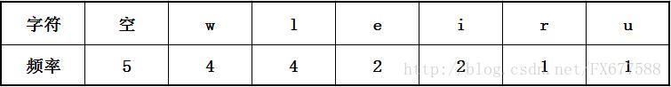
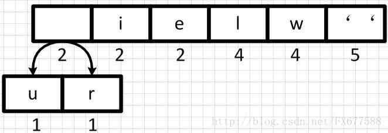
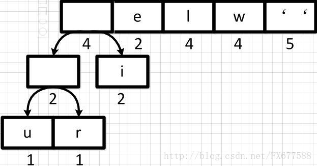
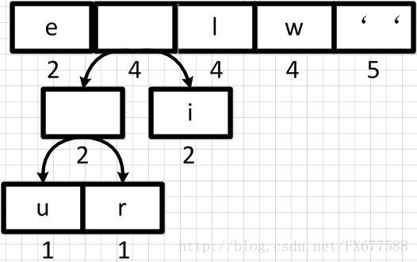
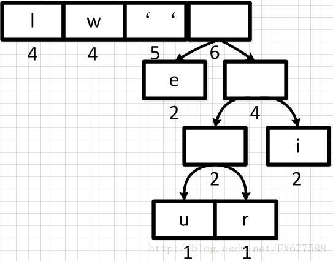
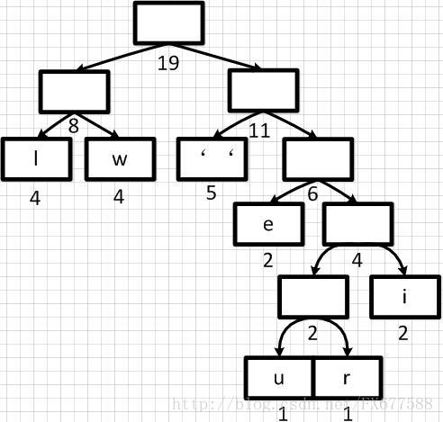
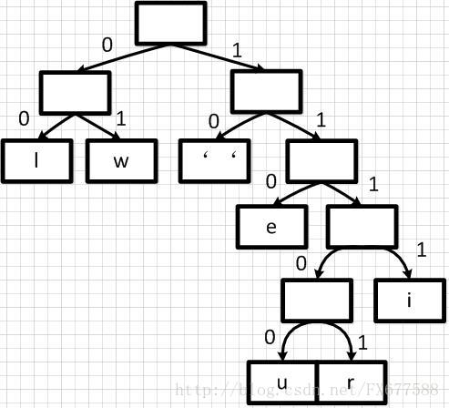
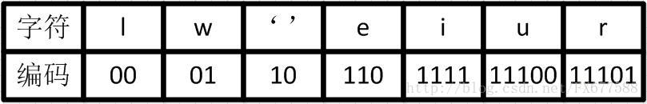

# 树的算法

## 哈夫曼编码(CSP-J 2023 10, CSP-J 2022 7) 贪心算法
1. 引言     
　　哈夫曼（Huffman）编码算法是基于二叉树构建编码压缩结构的，它是数据压缩中经典的一种算法。算法根据文本字符出现的频率，重新对字符进行编码。因为为了缩短编码的长度，我们自然希望频率越高的词，编码越短，这样最终才能最大化压缩存储文本数据的空间。    
　　假设现在我们要对下面这句歌词“we will we will r u”进行压缩。我们可以想象，如果是使用ASCII码对这句话编码结果则为：119 101 32 119 105 108 108 32 119 101 32 119 105 108 108 32 114 32 117（十进制表示）。我们可以看出需要19个字节，也就是至少需要152位的内存空间去存储这些数据。   
　　很显然直接ASCII码编码是很浪费空间的，Unicode就更不用说了，下面我们先来统计一下这句话中每个字符出现的频率。如下表，按频率高低已排序：    

2. 哈夫曼二叉树构建
* 初始队列
　　那么我们按出现频率高低将其放入一个优先级队列中，从左到右依次为频率逐渐增加。

下面我们需要将这个队列转换成哈夫曼二叉树，哈夫曼二叉树是一颗带权重的二叉树，权重是由队列中每个字符出现的次数所决定的。并且哈夫曼二叉树始终保证权重越大的字符出现在越高的地方。
* 第一步合并  
　　首先我们从左到右进行合并，依次构建二叉树。第一步取前两个字符u和r来构造初始二叉树，第一个字符作为左节点，第二个元素作为右节点，然后两个元素相加作为新空元素，并且两者权重相加作为新元素的权重。  
  
同理，新元素可以和字符i再合并，如下：  
  
* 重新调整队列  
　　上图新元素权重相加后结果是变大了，需要对权重进行重新排序 。  
  
然后再依次从左到右合并，每合并一次则进行一次队列重新排序调整。如下：  
  
　经过多步操作之后，得到以下的哈夫曼二叉树结构，也就是一个带有权重的二叉树：  

* 哈夫曼编码    
　　有了上面带权重的二叉树之后，我们就可以进行编码了。我们把二叉树分支中左边的支路编码为0，右边分支表示为1，如下图：  
  
这样依次遍历这颗二叉树就可以获取得到所有字符的编码了。例如：‘ ’的编码为10，‘l’的编码为00，‘u’的编码为11100等等。经过这个编码设置之后我们可以发现，出现频率越高的字符越会在上层，这样它的编码越短；出现频率越低的字符越会在下层，编码越短。经过这样的设计，最终整个文本存储空间才会最大化的缩减。  
　　最终我们可以得到下面这张编码表：  
