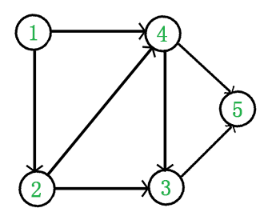
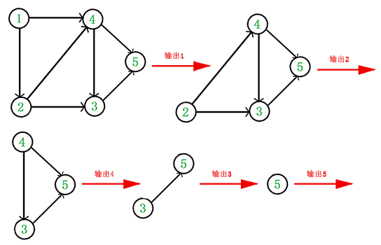

# 图算法
## 拓扑排序（Topological sorting）  
### 什么是拓扑排序（Topological sorting）
拓扑排序（Topological sorting）要解决的问题是如何给一个有向无环图的所有节点排序。    
拓扑排序满足的条件：     
1. 每个顶点出现且只出现一次。    
2. 若存在一条从顶点 A 到顶点 B 的路径，那么在序列中顶点 A 出现在顶点 B 的前面。      
有向无环图（DAG）才有拓扑排序，非DAG图没有拓扑排序一说。      
例如，下面这个图：   


它是一个 DAG 图，那么如何写出它的拓扑排序呢？这里说一种比较常用的方法：

1. 从 DAG 图中选择一个 没有前驱（即入度为0）的顶点并输出。
2. 从图中删除该顶点和所有以它为起点的有向边。
3. 重复 1 和 2 直到当前的 DAG 图为空或当前图中不存在无前驱的顶点为止。后一种情况说明有向图中必然存在环。

于是，得到拓扑排序后的结果是 { 1, 2, 4, 3, 5 }。  

通常，一个有向无环图可以有一个或多个拓扑排序序列。   
### 拓扑排序的应用
拓扑排序通常用来“排序”具有依赖关系的任务。例如C的完成必须在A和B完成之后。  

比如，如果用一个DAG图来表示一个工程，其中每个顶点表示工程中的一个任务，用有向边<script type="math/tex" id="MathJax-Element-1"> </script>表示在做任务 B 之前必须先完成任务 A。故在这个工程中，任意两个任务要么具有确定的先后关系，要么是没有关系，绝对不存在互相矛盾的关系（即环路）。  
### 拓扑排序的实现  
根据上面讲的方法，我们关键是要维护一个入度为0的顶点的集合。  

图的存储方式有两种：邻接矩阵和邻接表。这里我们采用邻接表来存储图，C++代码如下：  
```cpp
#include<iostream>
#include <list>
#include <queue>
using namespace std;

/************************类声明************************/
class Graph
{
    int V;             // 顶点个数
    list<int> *adj;    // 邻接表
    queue<int> q;      // 维护一个入度为0的顶点的集合
    int* indegree;     // 记录每个顶点的入度
public:
    Graph(int V);                   // 构造函数
    ~Graph();                       // 析构函数
    void addEdge(int v, int w);     // 添加边
    bool topological_sort();        // 拓扑排序
};

/************************类定义************************/
Graph::Graph(int V)
{
    this->V = V;
    adj = new list<int>[V];

    indegree = new int[V];  // 入度全部初始化为0
    for(int i=0; i<V; ++i)
        indegree[i] = 0;
}

Graph::~Graph()
{
    delete [] adj;
    delete [] indegree;
}

void Graph::addEdge(int v, int w)
{
    adj[v].push_back(w); 
    ++indegree[w];
}

bool Graph::topological_sort()
{
    for(int i=0; i<V; ++i)
        if(indegree[i] == 0)
            q.push(i);         // 将所有入度为0的顶点入队

    int count = 0;             // 计数，记录当前已经输出的顶点数 
    while(!q.empty())
    {
        int v = q.front();      // 从队列中取出一个顶点
        q.pop();

        cout << v << " ";      // 输出该顶点
        ++count;
        // 将所有v指向的顶点的入度减1，并将入度减为0的顶点入栈
        list<int>::iterator beg = adj[v].begin();
        for( ; beg!=adj[v].end(); ++beg)
            if(!(--indegree[*beg]))
                q.push(*beg);   // 若入度为0，则入栈
    }

    if(count < V)
        return false;           // 没有输出全部顶点，有向图中有回路
    else
        return true;            // 拓扑排序成功
}
```


## 图与边计算
1. 完全图：任意两点之间都存在一个边。
* 无向图：对于无向图中的完全图，任意两顶点之间都有一条双向的边（没有方向）。若有n个顶点，则有n(n − 1) / 2条边。
* 有向图：在有向图中，完全图要求任意两个顶点之间都有两条方向相反的边。若有n个顶点，则有n(n − 1)条边。
2. 连通图 (Connected Graph)
* 定义：在无向图中，连通图是指从任意一个顶点到任何其他顶点都存在至少一条路径。
* 简而言之：无向图：每个顶点都可以通过路径到达其他所有顶点。**有向图不适用**因为连通图这个概念专门针对无向图。 最少n-1条边。
3. 强连通图 (Strongly Connected Graph)
定义：在有向图中，强连通图是指对于任意一对顶点 强连通图 (Strongly Connected Graph)
定义：在有向图中，强连通图是指对于任意一对顶点u和v，都存在一条从u到v的路径，也存在一条v到u的路径。**不适用于无向图**。最少n-1条边。
