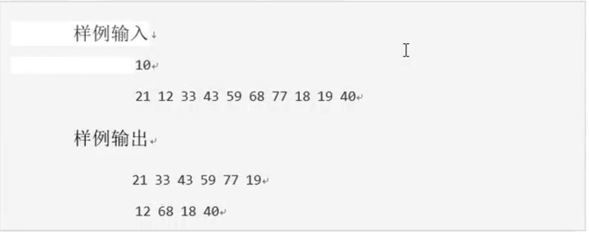
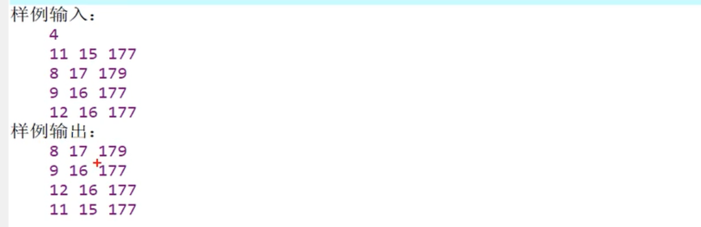

1. 输出奇数和偶数
* 题目描述：输入n个整数，将其中的奇数和偶数分别显示出来 1<n<30
* 输入：第一行一个整数n，第二行n个空格隔开的整数
* 输出：第一行，若干个奇数，第二行 若干偶数（每个数前面一个空格）
   
```cpp
#include<iostream>
#include<vector>
using namespace std;

const int N = 100;
int arr[N];

int main()
{
    // 1.输入n
    int n,num;
    cin >> n;
    vector<int> odds, evens;
    //2. 循环输入数据, 奇数放进奇数数组，偶数放进偶数数组
    for(int i=0; i<n;i++)
    {
        cin >> num;
        if(num % 2==0) evens.push_back(num);
        else odds.push_back(num);
    }
    //3. 奇数偶数分别输出
    for (int i = 0; i < odds.size(); i++)
    {
        cout << odds[i] <<' ';
    }
    cout <<endl;
    for (int i = 0; i < evens.size(); i++)
    {
        cout << evens[i] <<' ';
    }
    return 0;
}
```
2. 分糖果
* 题目描述：有n个小朋友围坐一圈，老师给每个小朋友随机分发偶数糖果，然后进行下面的游戏 ，每个小朋友把自己的糖果分一半给左手边的朋友，一轮分糖以后，拥有奇数颗糖果的孩子由老师补发一个糖果，从而变成偶数。反复进行这个游戏，直到所有的小朋友糖果数目相同为止，你的任务是预测在已知的初始糖果情形之下，老师一共补发多少颗糖果。
* 程序输入：第一行一个整数N 表示小朋友的人数。第二行用空格分开的N个偶数，每个偶数不大于1000，不小于2
* 程序输出：要求程序输出一个整数，表示老师需要补发的糖果数
* 样例输入： 
3   
2 2 4  
* 样例输出：  
```cpp
#include<iostream>
#include<vector>
using namespace std;
// 判断所有人的糖果是否相同，该函数参数为vector，返回值为bool
bool equalCandy(vector<int> & vec)
{
    if(vec.empty()) return true;
    int len = vec.size();
    for (int i = 1; i < len; i++)
    {
        if(vec[i] != vec[0]) return false;
    }
    return true; 
}

int main()
{
    // 1.输入n和每个人的初始糖果数目
    int n,num;
    cin >> n;
    vector<int> arr(n),tmp(n,0); 

    // 2.输入初始糖果数目
    for (int i = 0; i < n; i++)
    {
        cin >> arr[i];
    }
    int candy = 0; //3. 最终的添加的糖果值
    while(!equalCandy(arr))  // 当每个人的糖果相同的时候退出循环
    {
        for (int i = 0; i < n; i++) tmp[i] = arr[i] /2; //4. 每次分糖果之前将自己的一半存储在tmp数组
        for (int i = 0; i < n; i++) arr[i] /=2; //5. 每个人把自己的糖果处以2表示给出，
        for (int i = 0; i < n; i++) arr[i] += tmp[(i+1)%n]; // 6 每个人拿上自己的糖果
        for (int i = 0; i <n; i++)//7 当分完以后如果每个人的糖果是奇数的话，加上一颗
        {
            if(arr[i]%2 == 1)
            {
                arr[i] += 1;
                candy += 1;
            }
        }
    }
    // 输出一共添加的糖果数目
    cout << candy;
    
    return 0;
}
```
4    
3. 回形填数
*  题目描述：
    给定一个row行col列的整数数组array，
     要求从array[0][0]元素开始，
      按回形从外向内顺时针顺序遍历整个数组。
* 输入：
     输入的第一行上有两个整数，
      依次为row和col。余下有row行，
      每行包含col个整数，构成一个二维整数数组。
     （注：输入的row和co1保证     0<row<100   0<col<100
* 输出： 按遍历顺序输出每个整数，每个整数占一行 
* 样例输入：
4 4
1 2 3 4 
12 13 14 5
11 16 15 6
10 9 8 7 
* 样例输出：
1    
2  
3  
4  
5  
6  
7  
8  
···  
15   
16 
```cpp
#include <iostream>
#include <cstring>
#include<vector>
using namespace std;
int main()
{
	int colomn;
	int row;
	int a[102][102] = { 0 };  // 数字数组，表示输入的数组初始值
	bool b[102][102] = { 0 }; // 布尔数组表示该位置是否已访问，初始全为1
	cin >> colomn >> row;
	for (int i = 1; i <= colomn; i++)
		for (int j = 1; j <= row; j++) {
			cin >> a[i][j];
			b[i][j] = 1;
		}
	int m = colomn * row;//总的元素个数
	int i = 1; //横纵的下标都从1开始
	int j = 1;
	int N = 0; //表示目前已访问的元素个数
	while (N <m) { 
		while ((i <= colomn) && (b[i][j])&&(j<=row)) {
			b[i][j] = 0;
			cout << a[i][j++] << endl;
			//前置++先自加再使用，后置++先使用后自加
			//所以这里是先使用后自加
			N++;
		}//向右逐渐移动
		i++; j--;//走到了不该走的地方，要退后一格并向下走
		while ((i <= colomn) && (b[i][j]) && (j <= row)) {
			b[i][j] = 0;
			cout << a[i++][j] << endl;
			N++;
		}
		i--; j--;
		while ((i <= colomn) && (b[i][j]) && (j <= row)) {
			b[i][j] = 0;
			cout << a[i][j--] << endl;
			N++;
		}
		i--; j++;
		while ((i <= colomn) && (b[i][j]) && (j <= row)) {
			b[i][j] = 0;
			cout << a[i--][j] << endl;
			N++;
		}
		i++; j++;
	}
	return 0;
}

``` 
4. 结构体排序
* 题日描述：
          我们需要对n个人（Person）进行排厅，
        规则如下：每个人有3个属性，id，age，height（int型）。
        优先按照height由高到低排名，height相同的则按照age由大到小排序，
         age相同的则按照id由小到大排序。
* 输入：
          输入第一行为需要排序的人数n，
        接下来的n行输入每一个人的id、age、height
* 输出：
           输出n行为最后排序的结果，
           同一个人的属性在同一行输出，输出下一个人需要换行

```cpp
#include<iostream>
#include<vector>
#include<algorithm>
using namespace std;
// 判断所有人的糖果是否相同，该函数参数为vector，返回值为bool

struct Person
{
    int id;
    int age;
    int height;
};
bool cmp(Person & p1, Person & p2)
{
    // 首先判断height是否相同，不相同的话判断height 高的在前
    if(p1.height != p2.height) return p1.height > p2.height; 
    // height相同的情况下，判断age，age相同的话判断id
    else{
        if(p1.age != p2.age) return p1.age > p2.age;
        else return p1.id < p2.id;
    }
}
int main()
{
    int n;
    cin >>n;
    vector<Person> arr(n);
    for (int i = 0; i < n; i++)
    {
        cin >> arr[i].id;
        cin >> arr[i].age;
        cin >> arr[i].height;
    }
    sort(arr.begin(), arr.end(), cmp);
    for (int i = 0; i < n; i++)
    {
        cout << arr[i].id << ' ' <<arr[i].age << ' ' << arr[i].height<< endl;
    }
    
    return 0;
}
```
5. 报数（约瑟夫环问题）  
* 题目描述：  
    有n（n<=100）个人依次围成一圈，  
    从第1个人开始报数，数到第m（m<=100）个人出列，   
    然后从出列的下一个人开始报数，数到第m个人又出列，  
    如此反复到所有的人全部出列为止。  
    设n个人的编号分别为1，2，。。。，n打印出列的顺序。  
* 输入   
    两个整数：n和m， （n<=100）   
* 输出：n个数字，表示出列的顺序，使用空格隔开  
* 输入样例：10 3  
* 输出样例： 3 6 9 2 7 1 8 5 10 4
```cpp
#include<iostream>
#include<vector>
using namespace std;

int main()
{
    int n, m;
    cin >> n >> m;
    // 1. 构建两个数组一个nums，一个是flag布尔数组表示是否访问过
    vector<int> nums, flag(n,0);
    // 2. 输入所有数字
    for (int i = 1; i <=n; i++) nums.push_back(i);
    int index = -1;
    // 3. 由于要输出n次所以构建一个n次循环
    for (int i = 0; i < n; i++)
    {
        // 4. 每次循环中构建一个变量表示当前遍历到第几个元素
        int increment = 0;
        while(increment != 3)
        {
            // 如果下一个元素没有访问，则增量加一
            if(flag[(index+1)%n] == 0) increment += 1;
            index = (index + 1)%n; // 当前位置无论如何都要加一个
        }
        cout << nums[index] << ' ';
        flag[index] = 1;
    }
    
    
    return 0;
}
```