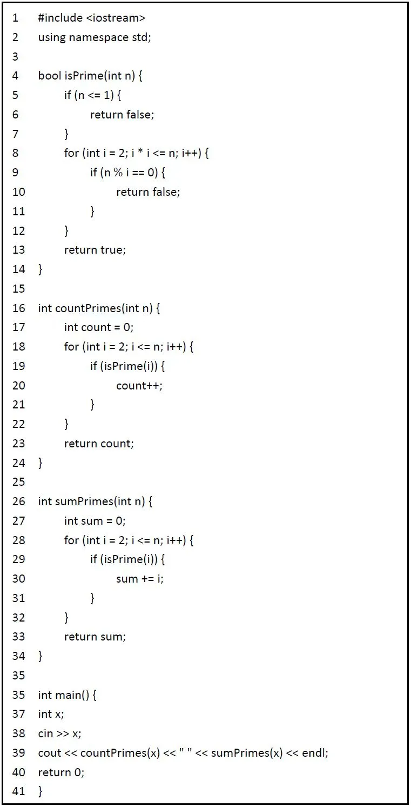
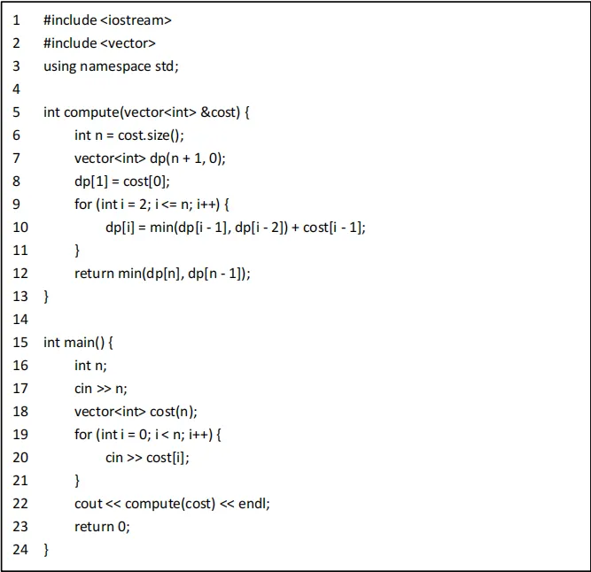
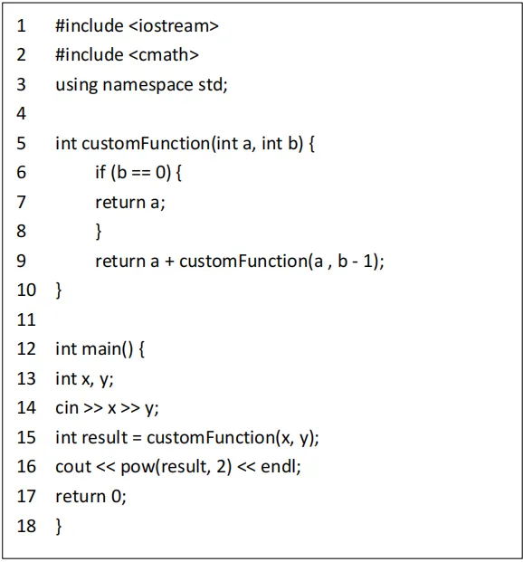
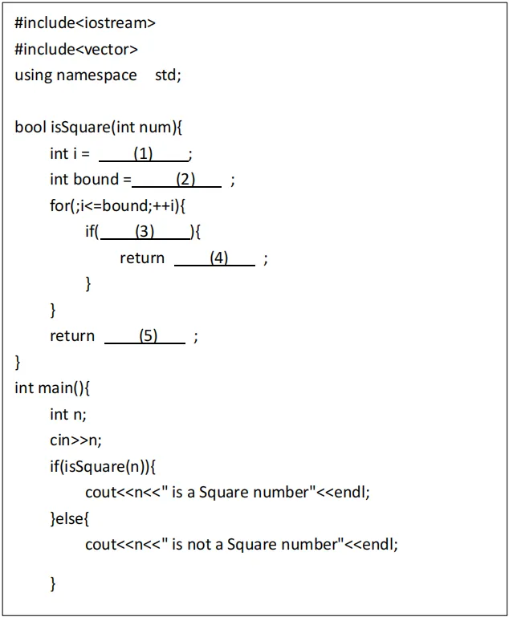
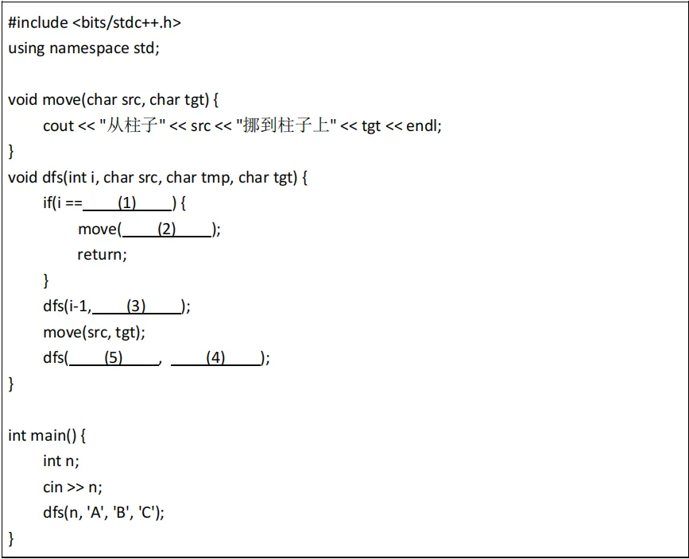

# 2024CSP-J
## 一、单项选择题(每题2分，共计30分)
1. 1.32 位 int 类型的存储范围是（ ）   
A. -2147483647~+2147483647  
B. -2147483647~+2147483648  
C. -2147483648~+2147483647  
D. -2147483648~+2147483648  

【答案】C
【解析】32位int类型使用二进制补码表示。
最小值：1000 0000 0000 0000 0000 0000 0000 0000 (二进制) =-231= -2147483648
最大值：0111 1111 1111 1111 1111 1111 1111 1111 (二进制) =231- 1 = 2147483647
int的范围为"-231~231- 1"，即"-2147483648 ~ 2147483647"

2. 计算$(14_8  − 1010_2) \times D_16  − 1101_2$的结果，并选择答案的十进制值（ ）   
A.13    
B.14     
C.15    
D.16    
【答案】A  都转10进制
【解析】  
148 (八进制) = 1*81 + 4*80 = 8 + 4 = 12 (十进制)
10102 (二进制) = 1*23 + 0*22 + 1*21 + 0*20 = 8 + 0 + 2 + 0 = 10 (十进制)
D16 (十六进制) = 13 (十进制)
11012 (二进制) = 1*23 + 1*22 + 0*21 + 1*20 = 8 + 4 + 0 + 1 = 13 (十进制)
计算过程：(12 - 10) * 13 - 13 = 2 * 13 - 13 = 26 - 13 = 13
   因此，结果为13（十进制）
3. 某公司有 10 名员工，分为 3 个部门：A 部门有 4 名员工，B 部门有 3 名员工、C 部门有3 名员工。现需要从这 10 名员工中选出 4 名组成一个工作组，且每个部门至少要有 1 人。问有多少种选择方式？（ ）  

A.120    
B.126    
C.132    
D.238    

【答案】B  
【解析】这是一个组合问题，我们需要考虑所有可能的情况：
因为一共选出4个人，每个部门至少要有 1 人，这样只有一种可能，就是某个部门选出2个人，另两个部分各选出1各人：
A选2人，BC各一人：C(4,2) * C(3,1) * C(3,1) = 6 * 3 * 3 = 54
B选2人，AC各一人：C(3,2) * C(4,1) * C(3,1) = 3 * 4 * 3 = 36
C选2人，AB各一人：C(3,2) * C(4,1) * C(3,1) = 3 * 4 * 3 = 36

总和：54 + 36 + 36 = 126

4. 以下哪个序列对应数组 0 至 8 的 4 位二进制格雷码（Gray code）？  
A.0000，0001，0011，0010，0110，0111，0101，1000   
B.0000，0001，0011，0010，0110，0111，0100，0101    
C.0000，0001，0011，0010，0100，0101，0111，0110    
D.0000，0001，0011，0010，0110，0111，0101，0100   
【答案】D
【解析】格雷码（Gray code）是一个数列集合，其中任意两个相邻的数值仅有一个二进制位不同。
4位格雷码的生成过程：
1. 从0000开始
2. 每次改变一个位，使得新的数字与前一个数字只相差一位
3. 确保所有16个4位二进制数都被使用一次
选项D正确地表示了0到7的4位格雷码序列。可以验证每对相邻的数只有一位不同。

格雷码的作用和场景
误差最小化：在数字电子系统中，特别是在模拟到数字转换过程中，使用格雷码可以最小化因位转换错误造成的错误。当从一个数到另一个数转换时，只改变一个二进制位可以减少错误发生的机会，从而提高系统的可靠性。

旋转编码器：在旋转编码器中，格雷码被广泛使用。旋转编码器常用于测量角度位置，并将物理位置转换为相应的编码。由于旋转过程中相邻位置只差一个位，使用格雷码可以有效防止在位置切换时由于多位同时改变导致的错误解码。

通信系统：在某些数字通信系统中，格雷码被用于减少因信号在传输过程中的小幅扰动导致的错误。由于格雷码的这种单变位特性，它帮助减少了误差的传播。

FPGA 和 ASIC 设计：在这些数字电路设计中，格雷码用于各种计数和数据传输任务，以确保数据传输的完整性和减少误差。
原文链接：https://blog.csdn.net/weixin_42599499/article/details/137872318
【解析】格雷码（Gray code）是一个数列集合，其中任意两个相邻的数值仅有一个二进制位不同。
三位的gray code可以生成2的3次方个格雷码，也就是8个码
1. 初始化一个n位的全零字码
2. 改变最右边的码
3. 改变从右往左第一个为1的左边的码数的位值
4. 重复2和3直到完成2的n次方个格雷码  

5. 记 1Kb 位 1024 字节（byte），1MB 位 1024KB，那么 1MB 是多少二进制位（bit）? 

A.1000000   
B.1048576        
C.8000000    
D.8388608   

【答案】D
【解析】1KB = 1024字节(byte)
1MB = 1024KB
1字节 = 8 bit
因此,1MB = 1024 * 1024 * 8 = 8388608 bit
正确答案是D. 8388608

6. 以下哪个不是 C++中的基本数据类型？
A. Int  
B. float  
C. struct  
D. char  
【答案】C

【解析】int, float, 和char都是C++的基本数据类型
struct是用户自定义的复合数据类型,不是基本数据类型
正确答案是C. struct
7. 以下哪个不是 C++中的循环语句？
A. for  
B. while  
C. do-while  
D. repeat-untill  
【答案】D
【解析】for, while, 和do-while都是C++支持的循环语句
repeat-until是Pascal等语言中的循环语句,C++不支持
正确答案是D. repeat-until
8. 在 C/C++中，(char)('a'+13)与下面的哪一个值相等（ ）   
A.'m'    
B. 'n'   
C. 'z'    
D. '3'  

B
9. 假设有序表中有 1000 个元素，则用二分法查找元素x 最多需要比较（ ）次

A.25    
B.10   
C.7  
D.1  
【答案】B
【解析】
二分查找每次将搜索范围减半
需要找到最小的n,使得$2^n > 1000$,
$2^{10} = 1024 > 1000$ 
因此,最多需要10次比较
正确答案: B. 10

10. 下面哪一个不是操作系统名字（ ）

A. Notepad  
B. Linux  
C. Windows  
D. macOS   
【答案】A
【解析】Linux, Windows, 和 macOS 都是操作系统
Notepad(记事本)是一个应用程序,不是操作系统
正确答案: A. Notepad

11. 在无向图中，所有顶点的度数之和等于（ ）
    
A. 图的边数  
B. 图的边数的两倍  
C. 图的定点数  
D． 图的定点数的两倍  
【答案】B
【解析】在无向图中,每条边连接两个顶点
每条边对两个顶点的度数都贡献1
因此,所有顶点的度数之和等于边数的两倍
正确答案: B. 图的边数的两倍
举个例子即可。

12. 已知二叉树的前序遍历为[A,B,D,E,C,F,G],中序遍历为[D,B,E,A,F,C,G],求二叉树的后序遍历的结果是（ ）

A. [D,E,B,F,G,C,A]    
B. [D,E,B,F,G,A,C]    
C. [D,B,E,F,G,C,A]    
D. [D,E,B,F,G,A,C]    
【答案】A
【解析】给出的是前序遍历[A,B,D,E,C,F,G]和中序遍历[D,B,E,A,F,C,G]
根据前序遍历,我们知道A是根节点
利用中序遍历,我们可以分割左右子树:[DBE]A[FCG]
递归地应用这个过程,我们可以重构整棵树
然后进行后序遍历得到:[D,E,B,F,G,C,A]
正确答案: A. [D,E,B,F,G,C,A]
13. 给定一个空栈，支持入栈和出栈操作。若入栈操作的元素依次是 1 2 3 4 5 6,其中 1 最先入栈，6 最后入栈，下面哪种出栈顺序是不可能的（ ）   

A.6 5 4 3 2 1    
B.1 6 5 4 3 2    
C.2 4 6 5 3 1    
D.1 3 5 2 4 6    
【答案】D  
【解析】选项A (654321): 可能,依次全部入栈后再全部出栈
选项B (165432): 可能,1入栈出栈,剩余依次入栈后出栈
选项C (246531): 可能,2入栈,1入栈出栈,4入栈,3入栈出栈,以此类推
选项D (135246): 不可能,因为2必须在1之后入栈,所以2不可能在5之后出栈

14. 有 5 个男生和 3 个女生站成一排，规定 3 个女生必须相邻，问有多少种不同的排列方式？

A. 4320 种   
B. 5040 种   
C. 3600 种   
D. 2880 种    
【答案】A  
【解析】将3个女生看作一个整体,那么就变成了6个元素的排列

6个元素的排列方式有6! = 720种

3个女生之间还可以互相调换位置,有3! = 6种

总的排列方式 = 720 * 6 = 4320种

15. 编译器的主要作用是什么（ ）？  

A. 直接执行源代码  
B. 将源代码转换为机器代码  
C. 进行代码调试  
D. 管理程序运行时的内存  

【答案】B  
【解析】编译器的主要作用是将高级编程语言编写的源代码转换为机器可以直接执行的机器代码
选项A描述的是汇编器的功能
选项C描述的是调试器的功能
选项D描述的是操作系统的内存管理功能

https://blog.csdn.net/xiaoyaolangwj/article/details/123898733

## 二，阅读程序（程序输入不超过数组或字符串定义的范围；判断题正确填V，错误填 x；除特殊说明外，判断题 1.5 分，选择题 3 分，共计 40 分）

### 程序1

【程序解析】
本程序逻辑比较简单，其中三个函数：isPrime(n) 是用来判断n是否为质数，如果是质数返回true，否则返回false；countPrimes(n) 是用统计2~n中所有质数的个数，并返回这个个数；sumPrimes(n) 是用来统计 2~n 中所有质数的和，并返回这个和。
主函数mian中给定了一个值x，然后输出2~x中所有质数的个数与所有质数的和。

16. 判断题：当输入为“10”时，程序的第一个输出为“4”，第二个输出为“17”。（ ）  
【答案】√  
【解析】2~10中的质数依次有：2,3,5,7，那么2~10中所有质数个数为：4，所有质数的和为 17。  
17. 若将 isPrime(i)函数种的条件改为 i<=n/2,输入“20”时，countPrimes(20)的输出将变为“6”（ ）  
【答案】× 
【解析】首先将条件修改为 i<=n/2 是不会引起程序错误，只会降低程序的运行效率。那么countPrimes(20)本质上还是计算2~20中的质数个数：2,3,5,7,11,13,17,19，共8个质数。
18. sumPrimes 函数计算的是从 2 到n 之间的所有素数之和（ ）  
【答案】√   
【解析】sumPrime函数是枚举2~n之间每个整数i，每次判断i如果是质数，则会把i累加到sum中，最终sum中存储的值就是 2~n之间所有的质数之和。
 
19. 当输入为“50”时，sumPrimes(50)的输出为（ ）     
A.1060    
B.328    
C.381    
D.275   
【答案】B
【解析】sumPrime 函数是计算2~n中所有的质数之和，2~50之间的质数有：2,3,5,7,11,13,17,19,23,29,31,37,41,43,47，其和值为 328。
20. 如果将 for(int i=2;i*i<=n;i++)改为 for(itn i=2;i<=n;i++),输入“10”时，程序的输出（ ）   
A. 将不能正确计算 10 以内素数个数及其和  
B. 仍然输出“4”和“17”   
C.输出“3”和 10  
D.输出结果不变，但运行时间更短  
【答案】A  
【解析】条件从 i*i <= n 改为 i <= n，那么会导致每次i都会枚举到n，n的约数一定有自己，所以对于任意的整数都会至少满足一次 n%i == 0 的条件，因此所有的数经过isPrime之后都会返回false，导致无法正确判断质数从而也无法统计质数的个数与质数和。判断2到n-1之间是否有因数。
  

### 程序2
  
程序解析】  
本程序实际实现了一个经典问题：上台阶问题，走到每个台阶都有一定的花费cost[]，每一步可以跨一个台阶或跨两个台阶，计算从最底层走到最顶层的最少花费。值得注意的是，站在最底层和最顶层是不需要花费的。
用 dp[i] 表示走到第i级台阶的最小花费，考虑最后一步即第i级台阶，有可能是一步跨一个台阶到第i级台阶，那么 dp[i] = dp[i - 1] + cost[i - 1]，也有可能是一步跨两个台阶到第 i 级台阶，那么有 dp[i] = dp[i - 2] + cost[i - 1]，所以得到状态转移方程：dp[i] = min(dp[i - 1], dp[i - 2]) + cost[i - 1]。
请问走到最顶层最少需要扣多少钱呢。
最终 min(dp[n], dp[n - 1]) 就是到达最顶层的最小花费，因为最后一步可能跨一步走到最顶层，也可能是跨两步走到最顶层。  
**举例子 1，5，7，3。**
21. 当输入的 cost 数组为{10，15，20}时，程序的输出为 15（ ）    
【答案】√  
【解析】从最底层先跨两步走到第2层，然后从第2层再跨两步直接走到最顶层，因此最少的花费应该是 15，只走了第2层台阶。
22. 如果将 dp[i-1]改为 dp[i-3]，程序可能会产生编译错误（ ）  
【答案】×
【解析】不会产生编译错误，只会修改了题目的逻辑，同时在运行的过程中会产生运行错误，因为dp[i - 3] 在i = 2时，会导致下标为负数。
23. 程序总是输出 cost 数组种的最小的元素（ ）  
【答案】×  
【解析】程序输出的是从最底层走到最顶层过程中走过的台阶的花费总和的最小值。
24. 当输入的 cost 数组为｛1,100,1,1,1,100,1,1,100,1｝时，程序的输出为（）。    
A.6  
B.7  
C.8  
D.9   
答案】A  
【解析】从最底层到最顶层的最优路线应该是：最底层->第1层->第3层->第5层->第7层->第8层->第10层->最顶层。走过的台阶花费之和为：第1层花费+第3层花费+第5层花费+第7层花费+第8层花费+第10层花费 = 1 + 1 + 1 + 1 + 1 + 1 = 6。
25. 如果输入的 cost 数组为｛10,15,30,5,5,10,20｝，程序的输出为()  

A.25

B.30
C.35
D.40
【答案】B  

【解析】从最底层到最顶层的最优路线应该是：最 底层->第2层->第4层->第6层->最顶层。走过的台阶花费之和为：第2层花费+第4层花费+第6层花费 = 15 + 5 + 10 = 30。
26. 若将代码中的 min(dp[i-1],dp[i-2])+cost[i-1]修改为 dp[i-1]+cost[i-2]，输入 cost 数组为{5,10,15}时，程序的输出为（）  
A.10    
B.15    
C.20    
D.25    
【答案】A   
【解析】将min(dp[i - 1], dp[i - 2]) + cost[i - 1] 修改为 dp[i - 1] + cost[i - 2] 之后，那么计算的逻辑会发生变化，这种修改意味着每一步只能从前一个台阶跳跃过来，并且要加上前一个台阶的费用，而不是当前台阶的费用。
dp[1] = cost[0] = 5
dp[2] = dp[1] + cost[0] = 5 + 5 = 10  
dp[3] = dp[2] + cost[1] = 10 + 10 = 20  
最终返回的结果为：min(dp[n], dp[n -  1]) = min(20, 10) = 10，因此结果为10。     

### 程序3
  
【程序解析】  
本程序逻辑比较简单，customFunction(a, b) 函数是通过递归实现计算两个整数 a 和 (b+1) 的乘积，主函数中是先通过customFunction计算 x*(y+1) 的结果，然后将结果进行平方后输出。  

27. 当输入为“2 3”时，customFunction（2,3）的返回值为“64”。（ ）
【答案】×
【解析】customFunction(2,3)是返回2 * (3+1) 的结果 8。注意是customFunction的返回值，而非最终输出的结果。

28. 当b 为负数时，customFunction（a，b）会陷入无限递归。（ ）
【答案】√
【解析】因为递归出口是 b == 0，当b为负数时，该条件不会成立，会继续执行return a + customFunction(a, b - 1); b的值越来越小，从而导致b == 0 的条件是无法成立，因此会陷入无限递归。
29. 当b 的值越大，程序的运行时间越长。（ ）  

【答案】√
【解析】整个程序的效率由customFunction函数决定，而customFunction函数的时间复杂度为 O(b)，所以b越大程序运行的时间越长。
30. 当输入为“5 4”时，customFunction（5,4）的返回值为( )。
A.5   
B.25   
C.250   
D.625  
【答案】B
【解析】customFunction(5,4)是返回5 * (4+1) 的结果 25。注意是customFunction的返回值，而非最终输出的结果。

31. 如果输入 x = 3 和y = 3，则程序的最终输出为（） 
A.27  
B.81  
C.144  
D.256  
【答案】C  
【解析】首先customFunction(5,4)是返回3 * (3+1) 的结果 12，即result = 12，输出 result的平方后的结果为 144。  
32. （4 分）若将 customFunction 函数改为“return a ＋ customFunction（a-1，b-1）；并输入“3 3”，则程序的最终输出为（）。
A.9    
B.16   
C.25   
D.36  
【答案】D
【解析】修改之后的customFunction功能是计算 a + (a-1) + (a-2) + ... + (a-b) 的结果，因此如数 3 3 customFunction返回 3 + 2 + 1 + 0 = 6，即result = 6，输出 result的平方后的结果为 36。   

## 三完善程序(每题3分，共计30分)
### (判断平方数) 问题：给定一个正整数 n，判断这个数 是不是完全平方数，即存在一个正整数 x 使得 x 的平方等于 n试补全程序
 
【程序解读】
本程序实现函数 isSquare(num)，用于判断数 num 是否为平方数，由主函数中的输出前判断可知，若 n 为完全平方数，则应返回 true，否则返回 false。根据第 8 行 i 的枚举范围，以及（3）（4）两空的设问，可知函数的实现较为暴力，其打算枚举 1~ 之间的整数 i，判断是否有 i² = n。  
 
33. ①处应填（）     
A. 1     
B. 2    
C. 3   
D. 4   
【答案】A  
【解析】函数要判断 n 是否为 i 的平方，在只保证 n 为正整数的情况下，要考虑到 n 可能为 1、2 这类极小的正整数，因此枚举范围要包括这些较小正整数的平方根，应从 1 开始，故选择 A 选项。  
34. ②处应填（)    
A. (int) floor(sqrt(num)-1)   
B. (int)floor(sqrt(num))   
C. floor(sqrt(num/2))-1   
D. floor(sqrt(num/2))   
【答案】B  
【解析】函数 floor(x) 为 C++ 中的向下取整函数，其返回 x 的向下取整结果，但入参和返回值都为 double 类型。实际上，在将 double 类型的值赋值给 int 类型时，会自动完成隐式类型转换转换，因此 A、B 选项的显式类型转换 (int) 实际不影响结果，可以去掉，只需关注取整前的结果即可。
对正整数 num，若其平方根存在，则为不超过  的最大整数。由向下取整函数的含义，可知应选择 B 选项。

35.  ③处应填（)      
A. num=2*i   
B. num== 2*i   
C. num=i*i   
D. num==i*i   
【答案】D
【解析】由 34 题 bound 指定的枚举范围，可知函数的实现方式是枚举可能成为 num 平方根的整数 i，并判断 i 是否确实为 num 的平方根，这要求 i * i = num。注意 C++ 语言中，= 为赋值运算符，== 为判断相等的关系运算符，应选择 D 选项。  
36. ④处应填（）      
A. num= 2*i    
B. num==2*i    
C. true    
D. false    
【答案】C
【解析】由 35 题的判定条件，可知其对应找到了 num 的正整数平方根的情形，此时 num 应为完全平方数，根据程序主函数中输出的条件，isSquare 函数应返回为真，故选择 C 选项。
37. ⑤处应填（）  
A. num= i*i     
B. num!=2*I    
C. true    
D. False    
【答案】D
【解析】若 num 为完全平方数，则应在循环过程中找到 num 的正整数平方根，并结束函数调用。若函数执行至（5），则说明 num 不存在正整数平方根，即 num 不是完全平方数，故选择 D 选项。  

### 程序（2）
（汉诺塔问题）给定三根柱子，分别标记为 A、B 和 C。初始状态下，柱子A 上有若干个圆盘，这些圆盘从上到下按从小到大的顺序排列。任务是将这些圆盘全部移到柱子 c 上，且必须保持原有顺序不变。在移动过程中，需要遵守以不规则：  
1. 只能从一根柱子的顶部取出圆盘，并将其放入另一根柱子的顶部。  
2. 每次只能移动一个圆盘  
3.小圆盘必须始终在大圆盘之上。  
试补全程序
  
【程序解读】
这是一个递归程序，不一定要完全按顺序填空，要先搞清整个程序逻辑。  
  
我们考虑把n个盘子从A移到C的整个移动过程分成三部分：先将n-1层盘子从A柱移动到B柱。再把第n个盘子从A柱移动到C柱。最后将n-1层盘子从B柱移动到C柱。
 
dfs（i，src，tmp，tgt）的意思是把i层盘子从src柱移动到tgt柱，移动过程中用tmp柱做中转。（src是英文源头source的缩写，tgt是目标target的缩写，tmp是临时temporary 的缩写。）

同样将这个移动过程分三部分来做：

先把i-1层盘子从src移动到tmp，tgt用做中转，对应代码第13行，是dfs（i-1，src，tgt，tmp）。所以第3空选B

再把第i个盘子从src移动到tgt，对应代码第14行。

最后把i-1层盘子从tmp移动到tgt，src用做中转，对应代码第15行，是dfs（i-1，tmp，src，tgt）。所以第4空选B，第5空选C。

最后考虑一下递归的出口。当只有一层盘子时，就不用中转了，直接把盘子从src移到tgt就行了。当i等于1时，只调用move（src，tgt）一次并返回即可。对应代码第9到12行，所以第1空选B，第2空选B。     
  
38. ①处应填（）     
A.0  
B.1  
C.2  
D.3  

【答案】B  
【解析】这是递归的终止条件。当只剩1个圆盘时,直接从源柱移到目标柱即可,不需要再递归。所以当i==1时,执行move操作并返回。  
39. ②处应填（)  
A. src,tmp   
B. src,tgt   
C. tmp,tgt    
D.tgt,tmp   
【答案】B
【解析】在递归终止条件下,需要将唯一的圆盘从源柱(src)移动到目标柱(tgt)。  
40. ③处应填（)
A. src,tmp,tgt  
B. src, tgt, tmp   
C. tgt, tmp, src  
D. tgt, src, tmp  
【答案】B 
【解析】这步是将i-1个圆盘从源柱(src)移到临时柱(tmp),用目标柱(tgt)作为中转。     
41. ④处应填（）
A. src, tmp, tgt  
B. tmp,src, tgt  
C. src, tgt,tmp  
D. tgt,src,tmp  
【答案】B 
【解析】这步是将i-1个圆盘从临时柱(tmp)移到目标柱(tgt),用源柱(src)作为中转。  
42. ⑤处应填（）  
A. 0  
B. 1  
C. i-1  
D. i  
【答案】C  
【解析】这里需要移动i-1个圆盘,因为第i个最大的圆盘已经在前面移动过了。  

