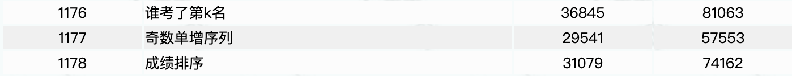

# 字符串

## 回文数及包含数字
输入两个数字x，y，数据范围是 0<=x<y< 2^64 ，对于x和y之间的每一个数，判断它是否是既是回文数又包含数字3，如果是的话就输出它。（要求使用string来处理数字,因为超出了整型数的表示范围）
* 代码示例：  
```cpp
#include<iostream>
#include<string>
using namespace std;
/*
    isPali 判断字符串是否是回文数
    hasNum3判断字符串是否含有3
*/
bool isPali(string str)
{
    int len = str.size();
    for(int i = 0; i < len/2;++i)
    {
        if (str[i]!=str[len-i-1]) return false;
    }
    return true;
}
bool hasNum3(string str)
{
    int len = str.size();
    for(int i = 0; i< len; ++i)
    {
        if(str[i] == '3')return true;
    }
    return false;
}
int main()
{
    int x, y;
    cin >> x >> y;
    for (int i = x; i <= y; i++)
    {
        string str = to_string(i);
        if(isPali(str)&&hasNum3(str))
            cout<< str <<endl;
        /* code */
    }
    
    return 0;
}
```
2. http://ybt.ssoier.cn:8088/index.php 信奥赛一本通的  1176 1177 1178
```cpp
#include<iostream>
#include<string>
#include<vector>
using namespace std;

int main()
{
    vector<int> arr(101,0);
    int n; 
    cin >> n;
    int k;
    for (int i = 0; i < n; i++)
    {
        cin >> k;
        if(k < 0) arr[k+101] ++;
        else arr[k] ++;
    }
    int max = 0, j=0;
    for (int i = 0; i < 101; i++)
    {
        if (arr[i] > max && i<=50) j = i;
        else j = i-101;
    }
    
    
    cout << j;
    return 0;
}
```