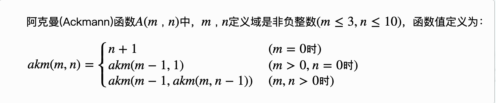

# 递归算法

## 阿克曼(Ackmann)函数
* 链接： http://ybt.ssoier.cn:8088/problem_show.php?pid=1163
* 题目描述：    
* 输入： m和n
* 输出： 函数值。
* 输入样例： 2 3 
* 输出样例： 9  


```cpp
#include<iostream>
using namespace std;
int akm(m, n)
{
    if(m == 0) return n +1 ;
    else if(m > 0 && n==0)return akm(m-1, 1);
    else if(m > 0 && n >0)return ajm(m-1, akm(m,n-1));
}
int main()
{
    int m, n;
    cin >> m >> n;
    cout << akm(m,n);

    return 0;
}
```
## Pell 函数
Pell数列a1,a2,a3,...的定义是这样的，a1=1,a2=2,...,an=2an−1+an−2(n>2)。   
给出一个正整数 k，要求Pell数列的第 k项模上 32767是多少。
```cpp
#include<iostream>
using namespace std;

int pell(int n)
{
    if(n <=2) return n;
    return 2 * pell(n-1) + pell(n-2);
}

int main()
{
    int n;
    cin >> n;
    cout  << pell(n);  
}

```