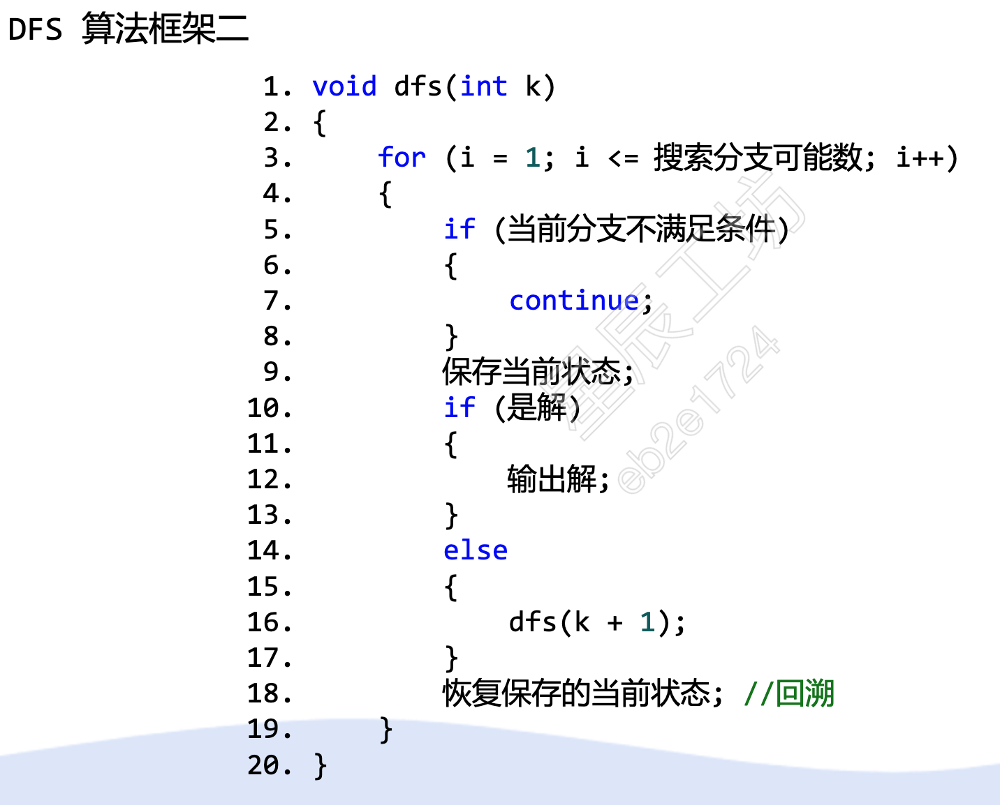
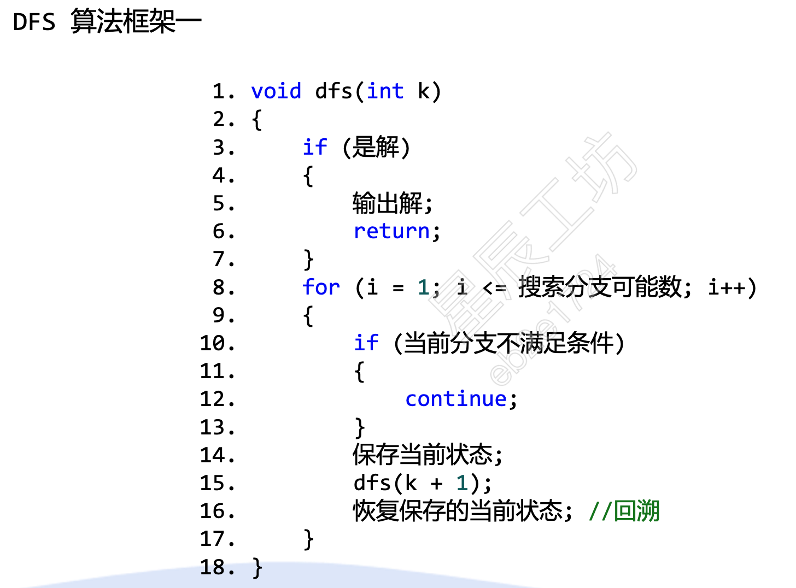
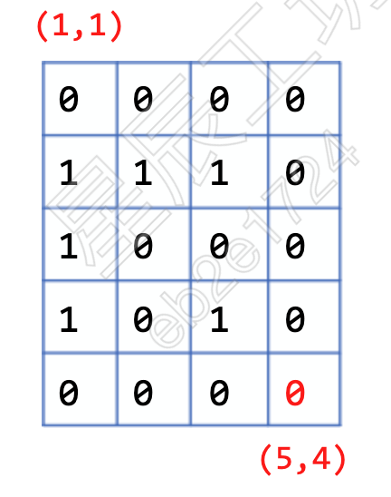
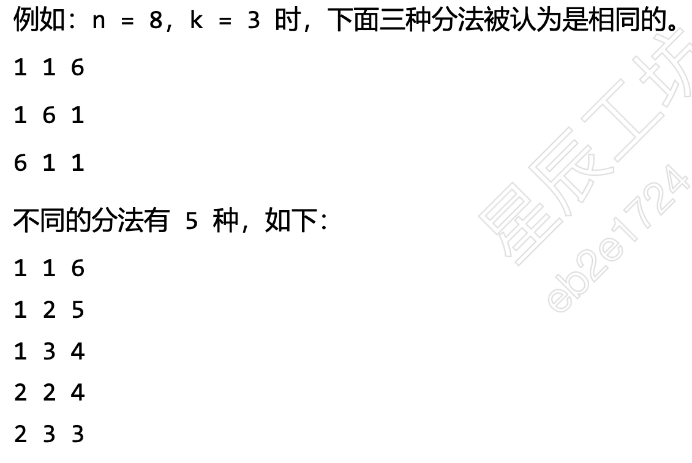
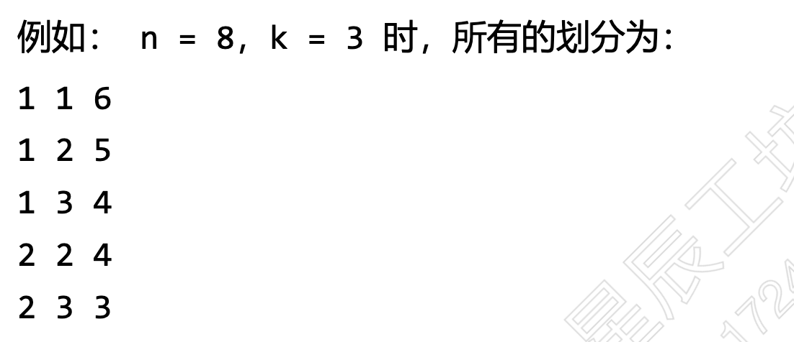

# 搜索算法深度优先搜索广度优先搜索

搜索算法：搜索算法就是指从图/树的某个节点开始，通过边到达不同的节点，最终找到目标结点的过程，根据搜索的策略不同，可以分为深度优先搜索（Depth-First Search）和广度优先搜索（Breadth-First Search）。所以在学习DFS和BFS之前，应该学习图和树的基本概念。  
树：一对多的结构  
图：多对多的结构

深度优先搜索采取“一条道走到黑的搜索方式”。这种搜索方式有两种实现方式：递归和非递归的形式。非递归的形式采用栈的方式来实现。由于该类算法实际上属于暴力解法，所以时间复杂度一般较高。通常需要采取剪枝等策略减少搜索次数提高效率。  
广度优先搜索实际上使用的是队列，每次将与当前节点相邻的节点入队。采取一种辐射状的搜索方式。   
## 深度优先搜索的模版
* 递归模版1

* 递归模版2 

## 迷宫步数
* 题目描述： 有一个5行4列的方格迷营，0表示可以通过，1表示不可以通过，每一步可以向上、下、左、右任意方向移动一步，请计算从左上角 （1,1） 位置移动到右下角 （5,4） 位置，最少移动多少步。目前的打算是用将近一节半课的时间把深度优先搜索讲完，然后带着同学们做一下往年鹏程杯的习题，熟悉一下鹏程杯的难度和题型，再复习一下易错点。最后根据同学们的反馈看看是否需要加课。
* 迷宫图：

* 代码示例： 
```cpp
#include<iostream>
using namespace std;
int dx[4] = {1, 0, -1, 0}; // 四个方向的行偏移量
int dy[4] = {0, -1, 0, 1}; //四个方向的列偏移量
int n, m, ans, a[15][15];   
bool vis[15][15];  //vis数组记录了小格子的访问状态
void dfs(int x, int y, int step)  //step表示到达当前点的步数
{ 
    if(x == n && y == m){      //到达右下角的话结束
        ans =min(ans, step);  //更新最短路径 
        return;
    }
    int tx, ty;
    for(int i =0; i< 4;++i){  //探索四个方向
        tx = x +dx[i];
        ty = y +dy[i];
        if(tx >=1 && tx <=n &&ty >=1 && ty <=m){  //探索的格子在矩阵内
            if(!vis[tx][ty] && a[tx][ty] == 0){  // 小格子未走过且可以走
                vis[tx][ty] = true;    //将当前格子标记过走过
                dfs(tx, ty, step +1);  //探索该方向
                vis[tx][ty] = false;   //回溯的时候恢复该点的原始状态
            }
        }
    }
}
int main()
{
    cin >> n >>m;
    for(int i = 1;i <=n;i++)
    {
        for(int j = 1; j <=m;++j)
            cin >> a[i][j];
    }
    ans = 0x3f3f3f; // 找最小值，初始为一个极大值
    vis[1][1]=true; //标记为已访问
    dfs(1, 1, 0); //调用函数 
    cout << ans;
    return 0;
}
```
## 数的划分
* 题目描述：将正整数划分为k份，每份不能为空，不考虑数的顺序，请计算出多少种不同的分法。
* 例如： 
* 样例输入： 8 3 
* 样例输出： 5 
* 算法分析：如果说我们保证每次划分的数都大于等于前面的数，这样可以做到不重复不漏。例如：

这题可以转换成：
有k个位置，每个位置上的数都大于等于它前面的数，所有位置上的数的总和为n的方案数。  
可以给 dfs 函数加一个参数 start，表示当前位置可以放的最小的数  
另外，再增加一个参数 sum 表示当前位置之前所有位置上的数的和  
u表示当前位置的编号  
void dfs(int u, int start, int sum)
{

}
* 示例代码：
```cpp
#include<iostream>
using namespace std;
int n, k, ans;
void dfs(intint start， int sum)
{
    if（u==k+1）// 已分完k份
    {
        if（sum==n）//n 已全部分完
        {
            ans ++;
        }
        return ;
    }
    for(int i =start;i <= n;++i)//没分完， 继续分  如何优化for(ini i =0; i<= (n-sum)/(k-u+1);++i)
    {
        dfs(u +1 , i, sum+i);
    }
}
int mai()
{
    cin >> n >> k;
    dfs(1, 1, 0);
    cout << ans;
    return 0;
}
```
