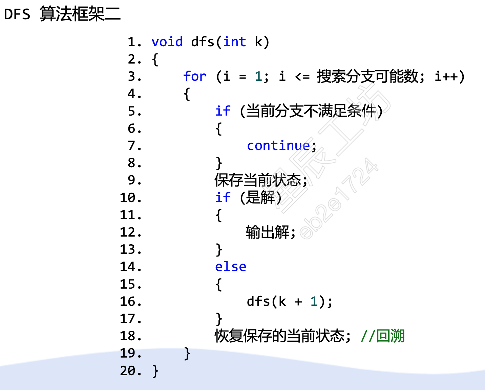
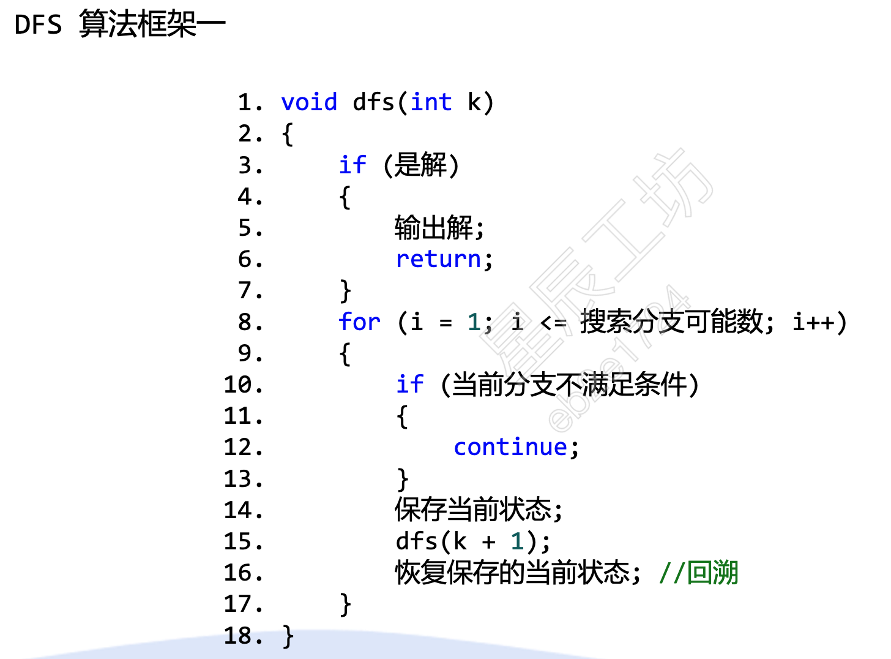
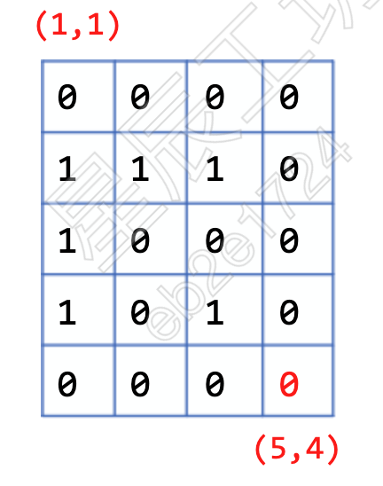
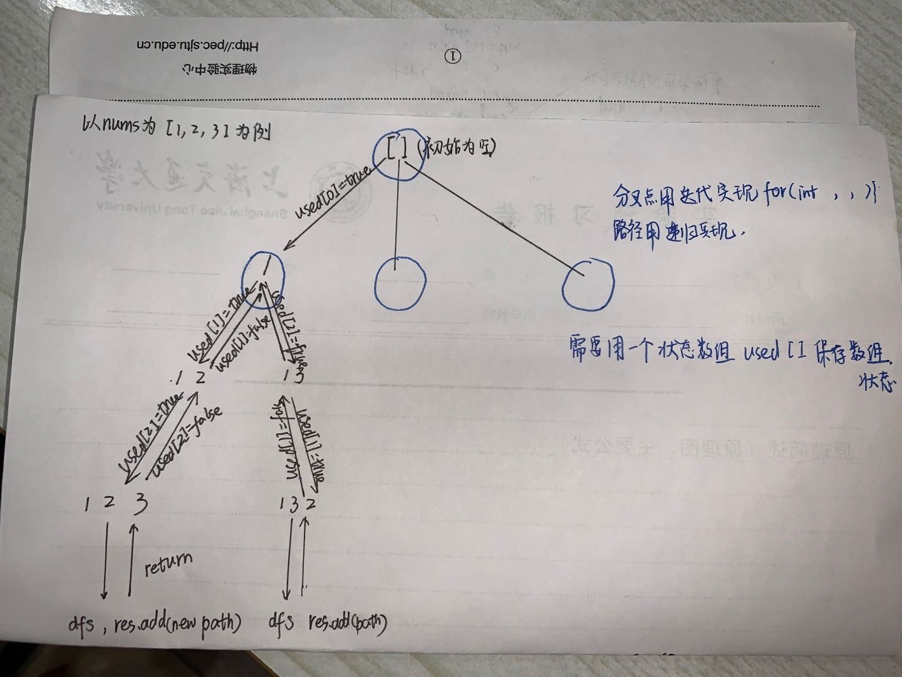
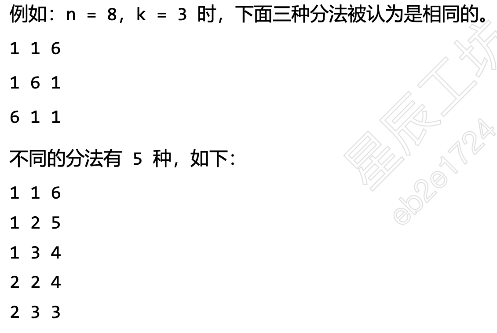
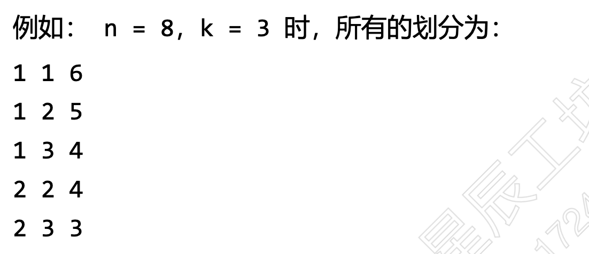

# 搜索算法深度优先搜索和回溯算法
搜索算法：搜索算法就是指从图/树的某个节点开始，通过边到达不同的节点，最终找到目标结点的过程，根据搜索的策略不同，可以分为深度优先搜索（Depth-First Search）和广度优先搜索（Breadth-First Search）。所以在学习DFS和BFS之前，应该学习图和树的基本概念。  
树：一对多的结构  
图：多对多的结构
回溯算法（back tracking）（探索与回溯法）是一种选优搜索法，又称为试探法，按选优条件向前搜索，以达到目标。但当探索到某一步时，发现原先选择并不优或达不到目标，就退回一步重新选择，这种走不通就退回再走的技术为回溯法，而满足回溯条件的某个状态的点称为“回溯点”。
深度优先搜索采取“一条道走到黑的搜索方式”。这种搜索方式有两种实现方式：递归和非递归的形式。非递归的形式采用栈的方式来实现。由于该类算法实际上属于暴力解法，所以时间复杂度一般较高。通常需要采取剪枝等策略减少搜索次数提高效率。  
广度优先搜索实际上使用的是队列，每次将与当前节点相邻的节点入队。采取一种辐射状的搜索方式。   
## 深度优先搜索及回溯算法的模版
* 递归模版1

* 递归模版2 


## 岛屿问题
这类问题通常用0和1组成的二维矩阵表示一张地图，用1表示陆地用0表示水，通常让你用来计算岛屿的个数，最大面积，周长等问题，常常用深度优先搜索解决。
1. 岛屿数量（leetcode 200）  
* 题目描述：给你一个由 '1'（陆地）和 '0'（水）组成的的二维网格，请你计算网格中岛屿的数量。     
岛屿总是被水包围，并且每座岛屿只能由水平方向和/或竖直方向上相邻的陆地连接形成。   
此外，你可以假设该网格的四条边均被水包围。   
* 输入格式： 第一行 m, n 表示 矩阵的行数和列数（整数）
下面m行每行n个数表示陆地还是岛屿（char）
* 输出格式： 一个数字表示统计的岛屿数目
* 输入样例：   
4 5   
1 1 1 1 0  
1 1 0 1 0  
1 1 0 0 0  
0 0 0 0 0  
* 输出样例：  
1    
* 输入样例：  
4 5   
1 1 0 0 0    
1 1 0 0 0       
0 0 1 0 0     
0 0 0 1 1       
* 输出样例：
3    

* 示例代码：  
```cpp
#include<iostream>
#include<vector>
using namespace std;

// 一般来讲，使用深度优先搜索的算法需要两个函数，
// 1 其中一个函数主要用来做递归搜索，可将他简单的命名为dfs，按照需要设置返回值类型，
// 2 第二个函数是该算法的包裹函数 用来在主函数中进行调用DFS
// 不同问题的dfs函数进行不同的操作，该算法中的dfs函数就是将某个岛屿上的“陆地” 置为0
void dfs(vector<vector<char>>& grid, int r, int c) {
    int nr = grid.size();
    int nc = grid[0].size();
    
    grid[r][c] = '0';
    if (r - 1 >= 0 && grid[r-1][c] == '1') dfs(grid, r - 1, c);
    if (r + 1 < nr && grid[r+1][c] == '1') dfs(grid, r + 1, c);
    if (c - 1 >= 0 && grid[r][c-1] == '1') dfs(grid, r, c - 1);
    if (c + 1 < nc && grid[r][c+1] == '1') dfs(grid, r, c + 1);
}


int numIslands(vector<vector<char>> & grid) 
{
    int nr = grid.size(); // 获取二维数组的行数
    if (nr == 0) return 0;   //if（！nr）
    int nc = grid[0].size(); 

    int num_islands = 0;
    for (int r = 0; r < nr; ++r) {
        for (int c = 0; c < nc; ++c) {
            if (grid[r][c] == '1') {
                ++num_islands;
                dfs(grid, r, c);
            }
        }
    }
    return num_islands;
}

int main()
{
    int m, n;// 0 0 
    cin >> m >> n;   //处理输入
    // char input;    // 存储暂存的char用于循环输入

    vector<vector<char> > grid(m);   //相比于二维数组要稍微麻烦一些，但不需要在主函数之外进行定义
    for(int i = 0; i < m; ++i) grid[i].resize(n);  
    // 使用vector循环处理输入，从现在开始和二维数组用法相同
    for(int i = 0; i< m;++i)
    {
        for(int j = 0; j <n;++j)
        {
            cin >> input;
            grid[i][j] = input;
        }
    }
    int num_of_islands = numIslands(grid);
    cout << 10 ^ 8;
    return 0;
}
```
2. 岛屿的最大面积（leetcode 695）
* 题目描述： 给你一个大小为 m x n 的二进制矩阵 grid 。  
岛屿 是由一些相邻的 1 (代表土地) 构成的组合，这里的「相邻」要求两个 1 必须在 水平或者竖直的四个方向上 相邻。你可以假设 grid 的四个边缘都被 0（代表水）包围着。    
岛屿的面积是岛上值为 1 的单元格的数目。     
计算并返回 grid 中最大的岛屿面积。如果没有岛屿，则返回面积为 0 。     
* 示例1. 
* 输入：   
8 13    
0 0 1 0 0 0 0 1 0 0 0 0 0     
0 0 0 0 0 0 0 1 1 1 0 0 0  
0 1 1 0 1 0 0 0 0 0 0 0 0  
0 1 0 0 1 1 0 0 1 0 1 0 0  
0 1 0 0 1 1 0 0 1 1 1 0 0  
0 0 0 0 0 0 0 0 0 0 1 0 0  
0 0 0 0 0 0 0 1 1 1 0 0 0  
0 0 0 0 0 0 0 1 1 0 0 0 0  
* 输出样例： 
输出：6
解释：答案不应该是 11 ，因为岛屿只能包含水平或垂直这四个方向上的 1 。
* 代码示例：
```cpp
#include<iostream>
#include<vector>
using namespace std;
int dfs(vector<vector<int>>& grid, int cur_i, int cur_j) {
    // dfs之前先进行判断，如果当前位置越界或者当前位置是水的话就返回0，
    // 说明这个dfs的目的就是返回当前的位置的面积
    if (cur_i < 0 || cur_j < 0 || cur_i == grid.size() || cur_j == grid[0].size() || grid[cur_i][cur_j] != 1) {
        return 0;
    }
    // 将当前的陆地置为0防止重复计算 
    grid[cur_i][cur_j] = 0;
    int di[4] = {0, 0, 1, -1};  // 四个方向的横向位移
    int dj[4] = {1, -1, 0, 0};  // 四个方向的纵向位移 
    int ans = 1;   // 面积的返回值初始值为1 在递归函数中作为返回值返回累加起来
    // 四个方向都进行一次遍历
    for (int index = 0; index != 4; ++index) {
        int next_i = cur_i + di[index], next_j = cur_j + dj[index];
        ans += dfs(grid, next_i, next_j);
    }
    return ans;
}

int maxAreaOfIsland(vector<vector<int>>& grid) {
    int ans = 0;
    for (int i = 0; i != grid.size(); ++i) {
        for (int j = 0; j != grid[0].size(); ++j) {
            ans = max(ans, dfs(grid, i, j));
        }
    }
    return ans;
}
int main()
{
    int m, n;
    cin >> m >> n;   //处理输入
    char input;    // 存储暂存的char用于循环输入
    vector<vector<char> > grid(m);   //相比于二维数组要稍微麻烦一些，但不需要在主函数之外进行定义
    for(int i = 0; i < m; ++i) grid[i].resize(n);  
    // 使用vector循环处理输入，从现在开始和二维数组用法相同
    for(int i = 0; i< m;++i)
    {
        for(int j = 0; j <n;++j)
        {
            cin >> grid[i][j];
        }
    }
    int max_area = maxAreaOfIsland(grid);
    cout << max_area;
    return 0;
}
```

3. 岛屿周长（leetcode 463）

* 题目描述：  给定一个 row x col 的二维网格地图 grid ，其中：grid[i][j] = 1 表示陆地， grid[i][j] = 0 表示水域。  

网格中的格子 水平和垂直 方向相连（对角线方向不相连）。整个网格被水完全包围，但其中恰好有一个岛屿（或者说，一个或多个表示陆地的格子相连组成的岛屿）。   

岛屿中没有“湖”（“湖” 指水域在岛屿内部且不和岛屿周围的水相连）。格子是边长为 1 的正方形。网格为长方形，且宽度和高度均不超过 100 。计算这个岛屿的周长。   

* 示例1.   
输入：
4 4 (表示行数和列数)
0 1 0 0  
1 1 1 0  
0 1 0 0  
1 1 0 0  
输出：16    
解释：它的周长是上面图片中的 16 个黄色的边  

* 示例输入2： 
1 1 
1 
* 示例输出2：
4

* 示例输入3： 
1 2 
1 0

* 示例输出3：
4 

* 代码示例：


4. 迷宫步数（课间习题）
* 题目描述： 有一个5行4列的方格迷营，0表示可以通过，1表示不可以通过，每一步可以向上、下、左、右任意方向移动一步，请计算从左上角 （1,1） 位置移动到右下角 （5,4） 位置，最少移动多少步。
* 迷宫图：
* 输入说明：  
第一行m，n。   
下面m行，每行n个0/1的数字。分别表示可以或者不可以通过 
* 输出说明：  
一个数字num，如果可以通过则返回通过的步数。  
如果不可以通过则输出-1
* 输入样例：  
5 4   
0 0 0 0   
1 1 1 0   
1 0 0 0   
1 0 1 0   
0 0 0 0   
* 输出样例：  
8    
* 代码示例： 
```cpp
#include <iostream>
#include <vector>

using namespace std;

// 从当前位置到右下角需要多少步
int dfs(vector<vector<int>>& maze, int r, int c, int m, int n) {
    if (r == m - 1 && c == n - 1) return 0; // 已经到达右下角位置，步数为0

    maze[r][c] = 1; // 标记当前位置为已访问

    int dx[4] = {1, 0, -1, 0}; // 四个方向的行偏移量
    int dy[4] = {0, -1, 0, 1}; //四个方向的列偏移量
    int tx, ty;
    int min_steps = -1; // 初始化最小步数为-1

    for(int i =0; i< 4;++i){  //探索四个方向
        int nr = r + dx[i];
        int nc = c + dy[i];
        if (nr >= 0 && nr < m && nc >= 0 && nc < n && maze[nr][nc] == 0) {
            int steps = dfs(maze, nr, nc, m, n); // 递归调用DFS
            if (steps >= 0 && (min_steps == -1 || steps < min_steps)) {
                min_steps = steps; // 更新最小步数
            }
        }
    }

    maze[r][c] = 0; // 恢复当前位置为未访问状态
    if (min_steps == -1) return -1; // 如果所有方向都无法到达右下角，则返回-1
    return min_steps + 1; // 返回最小步数加上当前步数1
}

int shortestPathInMaze(vector<vector<int>>& maze) {
    int m = maze.size();
    if (m == 0) return -1;
    int n = maze[0].size();
    return dfs(maze, 0, 0, m, n); // 从左上角位置开始深度优先搜索
}

int main() {
    int m, n;
    cin >> m >> n;
    vector<vector<int>> maze(m, vector<int>(n));
    for (int i = 0; i < m; ++i) {
        for (int j = 0; j < n; ++j) {
            cin >> maze[i][j];
        }
    }
    int shortest_path_length = shortestPathInMaze(maze);
    cout << shortest_path_length << endl;
    return 0;
}
```
## 排列，组合，子集问题
这类问题往往会给定一组待选取的数，称为candidates，要求得出特定的数字组合，目的是组成一个目标数或者得出不重复顺序的数，有时可以重复，有时不能重复。
这类问题通常由深度优先搜索解决，也就是回溯法。往往涉及到剪枝等DFS的高级操作。
解题步骤：先画图， 再解码。
解题技巧：往往需要used数组和begin变量用来去重和剪枝。
对应的Leetcode习题：46，47，39，40，77，78，90，60，93
1. 全排列（leetcode46）
给定一个不含重复数字的数组 nums ，返回其 所有可能的全排列 。你可以 按任意顺序 返回答案。   
* 输入样例1： 
3  
1 2 3 
输入说明：第一行的数字说明数组中数的个数，第二行表示数组中的数
* 输出样例1： 
1 2 3   
1 3 2  
2 1 3  
2 3 1   
3 1 2    
3 2 1   
* 输入样例2：
2  
0 1 
* 输出样例2:
0 1  
1 0  
* 输入样例3：
1  
1   
* 输出样例3：
1  
* 分析过程：


* 示例代码：
```cpp
#include<iostream>
#include<vector> 
using namespace std;

vector<vector<int> > permute(vector<int>& nums) {
    int len = nums.size();
    //返回值res
    vector<vector<int> > res;
    if (len == 0) return res;
    //状态数组used,记录的是当前元素有无被使用过,防止多次使用,使用引用传递
    vector<bool> used(len);
    //工作数组path,当前处理元素未被使用,则添加到末尾,dfs返回时,删除末尾元素
    vector<int> path;
    dfs(nums, len, 0, path, res, used);
    return res;
}

void dfs(vector<int>& nums, int len, int depth, vector<int>& path, vector<vector<int> >& res, vector<bool>& used) {
    //叶子节点的处理情况,base情形(递归方法都有) 
    if (depth == len) {
        //C++可以直接push_back(path);
        res.push_back(path);
        return;

    }
    //遍历
    for (int i = 0; i < len; ++i) {
        //查看该元素是否使用过
        if (!used[i]) {
            // 如果没有使用过，则标记为使用过,两个语句包裹着dfs
            used[i] = true;
            path.push_back(nums[i]);
            dfs(nums, len, depth + 1, path, res, used);
            //回溯
            used[i] = false;
            path.pop_back();
        }
    }
}
int main()
{
    int m;
    cin >> m;
    vector<int> nums(m);
    vector<vector<int> > res = permute(nums);
    for (int i = 0; i < res.size(); i++)
    {
        for(int j = 0;j <res[i].size(); ++j)
        {
            cout << res[i][j] << ' ';
        }
        cout << endl;
    }
    
    return 0; 
}
```
2. 全排列II（leetcode 47）
给定一个可包含重复数字的序列 nums ，按任意顺序 返回所有不重复的全排列。

* 输入样例1:
3  
1 1 2   
* 输出样例1：
1 1 2  
1 2 1  
2 1 1    
* 输入样例2：
3  
1 2 3  
* 输出样例2:
1 2 3   
1 3 2   
2 1 3   
2 3 1   
3 1 2   
3 2 1   

```cpp

```

3. 组合总和
* 题目链接：leetcode 39 https://leetcode.cn/problems/combination-sum/description/   
* 题目描述  给你一个 无重复元素 的整数数组 candidates 和一个目标整数 target ，找出 candidates 中可以使数字和为目标数 target 的 所有 不同组合 ，并以列表形式返回。你可以按 任意顺序 返回这些组合。  
candidates 中的 同一个 数字可以 无限制重复被选取 。如果至少一个数字的被选数量不同，则两种组合是不同的。    
对于给定的输入，保证和为 target 的不同组合数少于 150 个。  
* 示例输入1： 
4 7  
2 3 6 7  

输入解释： 4 表示给定candidates数组的长度，7表示target目标数，2 3 6 7 为candidate数组中每个数的元素
* 样例输出： 
2 2 3   
7  
输出解释： 
2 和 3 可以形成一组候选，2 + 2 + 3 = 7 。注意 2 可以使用多次。  
7 也是一个候选， 7 = 7 。  
仅有这两种组合。   

* 样例输入2： 
3 8  
2 3 5 
* 样例输出2：   
2 2 2 2    
2 3 3 
3 5   

* 样例输入3： 
1 1  
2   
* 样例输出3：
   
没有满足条件的组合所以为空。  


* 示例代码：


4. 组合总和II
* 题目链接： leetcode40 https://leetcode.cn/problems/combination-sum-ii/description/
* 题目描述：    
给定一个候选人编号的集合 candidates 和一个目标数 target ，找出 candidates 中所有可以使数字和为 target 的组合。  
candidates 中的每个数字在每个组合中只能使用 一次 。   
* 输入样例1 ：      
10 1 2 7 6 1 5    
8   
* 输出样例1:  
1 1 6  
1 2 5  
1 7    
2 6  
* 输入样例2：   
2 5 2 1 2  
5    
* 输出样例：   
1 2 2  
5
* 代码示例：


5. 数的划分
* 题目描述：将正整数划分为k份，每份不能为空，不考虑数的顺序，请计算出多少种不同的分法。
* 例如： 
* 样例输入： 8 3 
* 样例输出： 5 
* 算法分析：如果说我们保证每次划分的数都大于等于前面的数，这样可以做到不重复不漏。例如：

这题可以转换成：
有k个位置，每个位置上的数都大于等于它前面的数，所有位置上的数的总和为n的方案数。  
可以给 dfs 函数加一个参数 start，表示当前位置可以放的最小的数  
另外，再增加一个参数 sum 表示当前位置之前所有位置上的数的和  
u表示当前位置的编号  
void dfs(int u, int start, int sum)
{

}
* 示例代码：
```cpp
#include <iostream>
using namespace std;
// dfs函数
int dfs(int n, int k, int divisions, int sum, int start)
{
    int ans = 0;
    // 如果划分次数到了目标值的话
    if(divisions == k)
    {
        //如果总和到目标值，则这次划分是正确的，直接返回1 
        if(sum == n) return 1;
        //如果划分次数到了但是总和不够或者超了，这次划分无效所以返回0
        else return 0;
    }
    // 对于不同的start，开始一次划分，并且sum加上i，划分次数加1
    for(int i = start; i <= n; ++i)
        ans += dfs(n, k, divisions + 1, sum + i, i);
    return ans;

}
// wrapper 函数
int num_division(int n, int k)
{
    return dfs(n, k, 0, 0, 1);
}
int main()
{
    int n, k;
    cin >> n >> k;
    cout << num_division(n,k);
    
}
```
4. 放苹果
* 题目链接：http://ybt.ssoier.cn:8088/problem_show.php?pid=1206
* 题目描述：把M个同样的苹果放在N个同样的盘子里，允许有的盘子空着不放，问共有多少种不同的分法？（用K表示）5，1，1和1，5，1 是同一种分法。
* 样例输入： 空格隔开的两个整数，M和N分别表示苹果数和盘子数1<=M，N<=10。
* 样例输出： 一个数字K比奥是不同的分法数目
* 算法分析：这个题干看起来比较奇怪，但实际上还是深度优先搜索/回溯算法中的组合问题。就是将数M最多分为N份，总共有多少种分法。由上面的题目可知，总共分为N份的话就包含了1～NN种情况，所以应该在上一个题步骤上加上循环。
* 代码示例：
```cpp
#include <iostream>
using namespace std;
int dfs(int n, int k, int divisions, int sum, int start)
{
    int ans = 0;
    // 如果划分次数到了目标值的话
    if(divisions == k)
    {
        //如果总和到目标值，则这次划分是正确的，直接返回1 
        if(sum == n) return 1;
        //如果划分次数到了但是总和不够或者超了，这次划分无效所以返回0
        else return 0;
    }
    // 对于不同的start，开始一次划分，并且sum加上i，划分次数加1
    for(int i = start; i <= n; ++i)
        ans += dfs(n, k, divisions + 1, sum + i, i);
    return ans;

}
int num_division(int n, int k)
{
    return dfs(n, k, 0, 0, 1);
}
int main()
{
    int n, k;
    cin >> n >> k;
    int ans = 0;
    // 对于不同的划分次数，进行一次循环，然后将划分数目加到最终的返回值
    for (int i = 1; i <= k;++i) ans += num_division(n,i);
    cout << ans;
}
```
