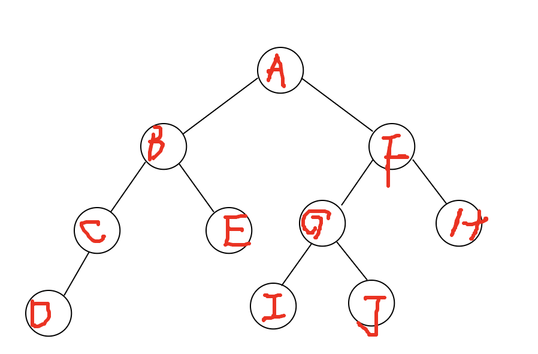
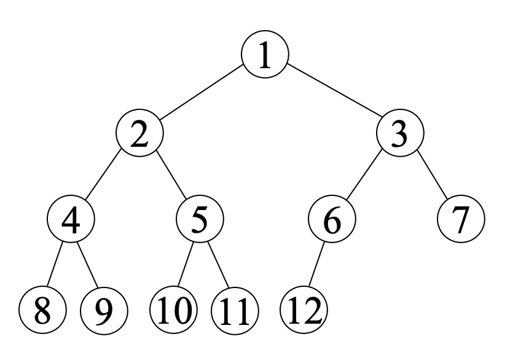

# 树与二叉树
## 填空题
1. 一颗二叉树的第8层最多有几个节点
2. 一个7层的二叉树最多共有几个节点 
3. 一颗非空二叉树叶子节点有109个，那么度为2的节点有几个
4. 一颗二叉树有89个节点，那么一共有多少个边

## 看图题
1. 写出下面树的先序和后序遍历
2. 画出下面树的兄弟节点表示法

int fn(int n)
{
    if(n <= 2) return n;
    return fn(n-1) + fn(n-2);
} 