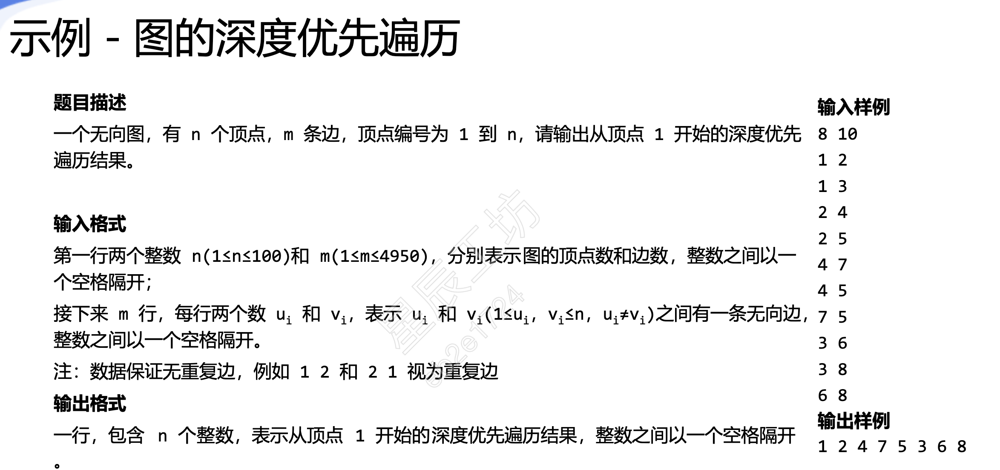
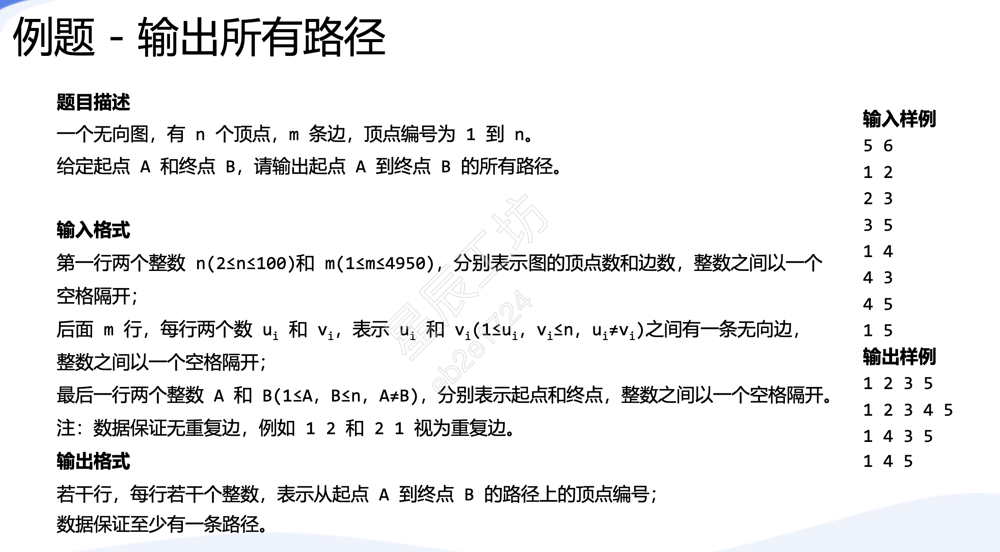
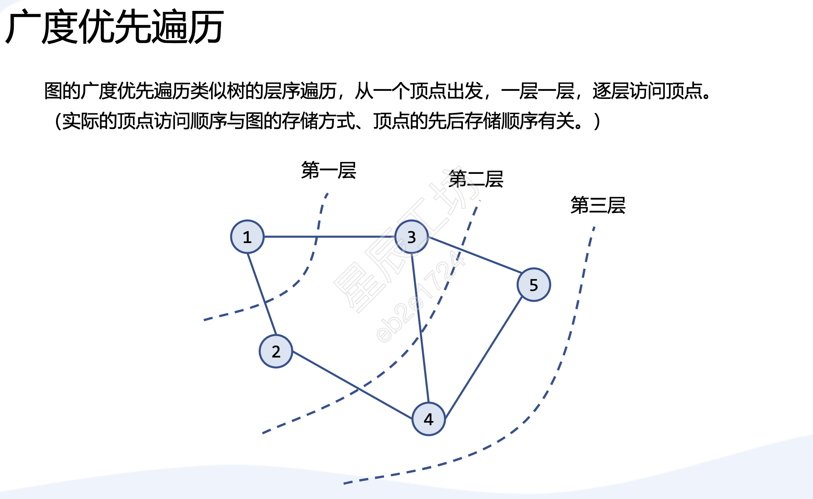
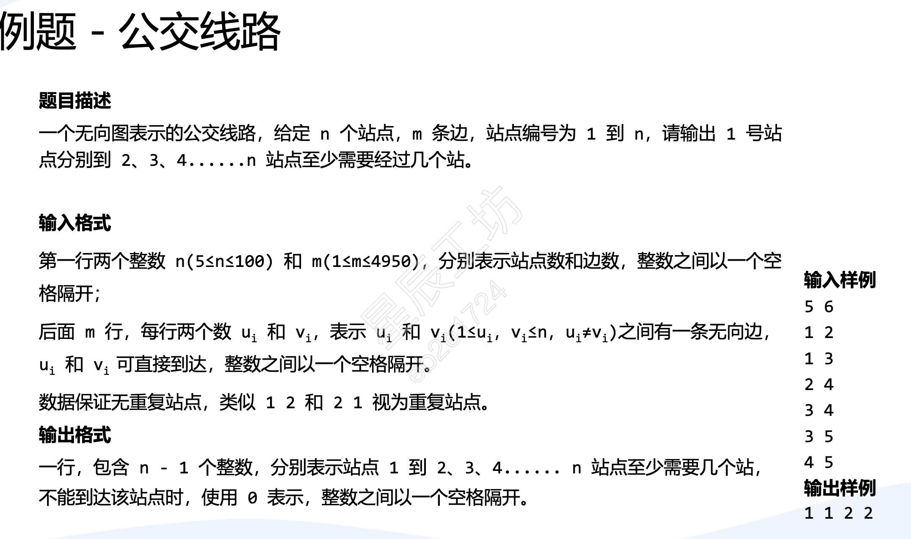

# 图


# 图的遍历
从图中某一个顶点出发，系统的访问图中所有的顶点，使得每个顶点恰好被访问一次，称为图的遍历。  
图的遍历分为深度优先搜索和广度优先搜索。  
## 图的深度优先搜索   
图的深度优先遍历类似树的先序遍历。选择未被访问的顶点作为起点，沿当前顶点
的边访问下一个未被访问的顶点，再沿当前访问顶点的边访问下一个未被访问的顶
点，如找不到未被访问的顶点，则返回上一个顶点，继续访问其他未被访问的顶点
以此类推，直全所有顶点都被访问。  
图的深度优先遍历类似于递归。 
例题：

输入样例：
```
8 10 
1 2 
1 3
2 4
2 5
4 7
4 5
7 5 
3 6
3 8
6 8
```
```cpp
#include<iostream>
#include<vector>
using namespace std;
const int MAX_N = 1005;

vector<int> g[MAX_N];
int n,m;
bool vis[MAX_N];

void dfs(int u)
{
    cout << u << " ";
    vis[u] = true;
    for (int i = 0; i < g[u].size(); i++)
    {
        int v = g[u][i];
        if(!vis[v]) dfs(v);
    }
    
}
int main()
{
    cin >> n >> m;
    for (int i = 1; i <= m ; i++)
    {
        int u, v;
        cin >> u >> v;
        g[u].push_back(v);
        g[v].push_back(u);
    }
    dfs(1);
    return 0;
}
```

例题2：

```
5 6 
1 2
2 3
3 5
1 4 
4 3
4 5
1 5
```
```cpp
#include<iostream>
#include<vector>
using namespace std;
const int MAX_N = 1005;

vector<int> g[MAX_N];
int n,m,a[MAX_N],A,B;
bool vis[MAX_N];

void dfs(int u, int x) //x表示顶点u是路径上的第几个点
{
    a[x] = u;
    if( u == B)  //如果找到终点的话，将路径上的顶点输出
    {
        for (int i = 1; i <= x; i++) cout << a[i] << ' ';
        cout <<endl;
        return ;
    }//如果没有找到终点的话，将当前顶点标记为已访问
    vis[u] = true;
    for (int i = 0; i < g[u].size(); i++)
    {
        int v = g[u][i];
        if(!vis[v]) dfs(v, x+1);
    }
    vis[u] = false;
    
}
int main()
{
    cin >> n >> m;
    for (int i = 1; i <= m ; i++)
    {
        int u, v;
        cin >> u >> v;
        g[u].push_back(v);
        g[v].push_back(u);
    }
    cin >> A >> B;
    dfs(A, 1); //从起点A，站点1开始搜
    return 0;
}
```

## 图的广度优先搜索
图的广度优先遍历类似树的层序遍历，从一个顶点出发，一层一层，逐层访问顶点从图的某顶点开始访问，被访问过的顶点作标记，接着依次访问其他邻接点；再从这些邻接点依次访问它们没被标记的邻接点，以此类推。
如果最后图中仍有顶点未被访问， 则另选未被访问的顶点作为起点，重复上述过程，直到所有顶点均已访问。
利用队列的特性可以更好完成图的逐层遍历、按序访问。  




例题：
 

## 泛洪填充