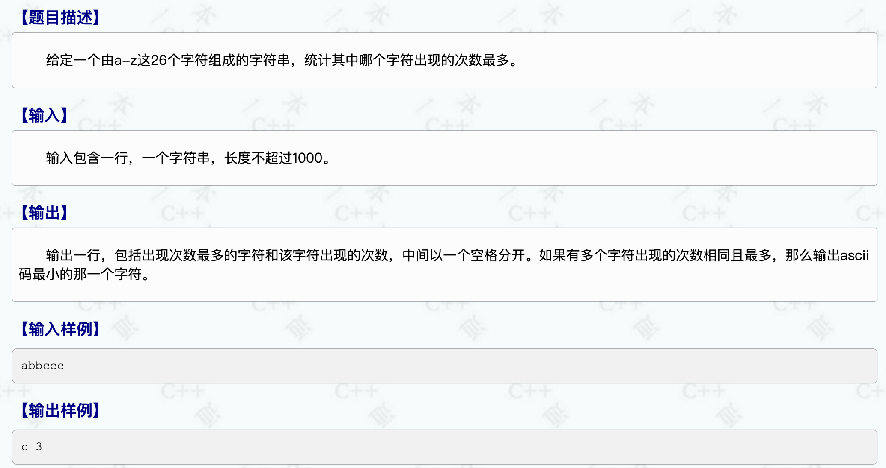
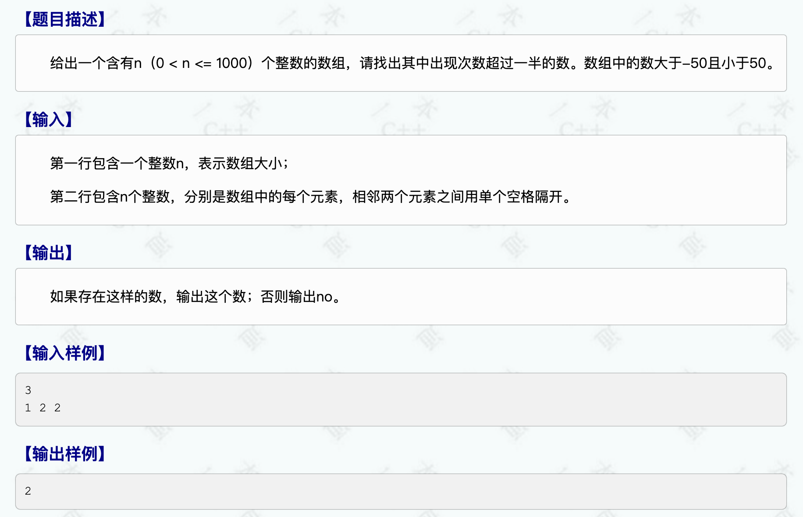

# 模拟算法
## 统计字符个数

* 程序示例：
```cpp
#include<iostream>
#include<string>
#include<vector>
using namespace std;

int main()
{
    string str;
    cin >> str;

    vector<int> analysis(26,0);
    int len = str.size();
    for (int i = 0; i < len; i++)
    {
        int index = str[i]-'a';
        analysis[index] ++;
    }
    int max = 0, k = 0;
    for (int i = 0; i < 26; i++)
    {
        if (analysis[i] > max)
        {
            max = analysis[i];
            k = i;
        }
        
    }
    cout << char('a' + k) << ' ' << max;
    
    
    return 0;
}
```
## 出现次数超过一半的数

* 程序示例：
