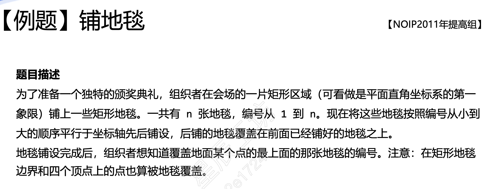
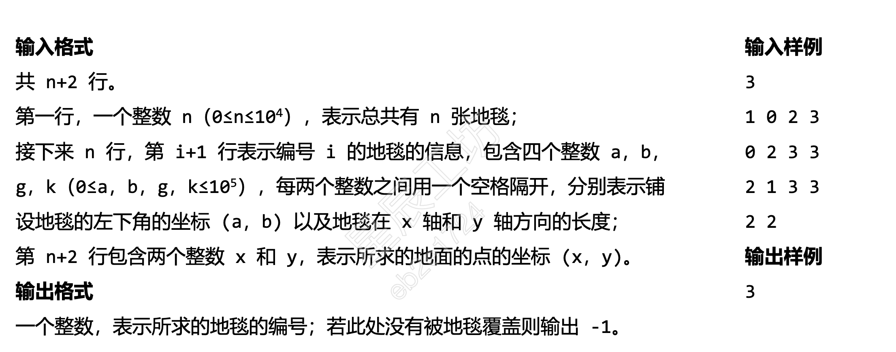

# 枚举算法
1. 确定枚举对象，范围和判断条件  
2. 逐一枚举可能的值，并验证每个解是否为可行的解  
3. 尽可能减少枚举的范围和对象数量，提高枚举算法的效率  

## 题目  
1. 铺地毯



* 解题思路：  
从最后一张地毯往前判断每一张地毯的范围内是否有该点
* 示例程序：  
```cpp
#include<iostream>
#include<vector>

using namespace std;

int main()
{
    int n, x, y;
    cin >> n;
    vector<int> a,b,g,k;
    int aa, bb, gg, kk;
    for(int i =0;i <n;++i)
    {
        cin >> aa >>bb >>gg >> kk;
        a.push_back(aa);
        b.push_back(bb);
        g.push_back(gg);
        k.push_back(kk);
    }
    cin >> x >> y;
    for(int i = n-1; i>=0;i--)
    {
        if(x >=a[i] && x <=a[i] +g[i] && y>= b[i] && y <b[i] + k[i])
        {
            cout << i+1 <<endl;
            return 0;
        }
    }
    cout << -1;
    return 0;
}
```


## 统计单词数
* 题目链接： http://ybt.ssoier.cn:8088/problem_show.php?pid=1400
* 题目描述：一般的文本编辑器都有查找单词的功能，该功能可以快速定位特定单词在文章中的位置，有的还能统计出特定单词在文章中出现的次数。

现在，请你编程实现这一功能，具体要求是：给定一个单词，请你输出它在给定的文章中出现的次数和第一次出现的位置。注意：匹配单词时，不区分大小写，但要求完全匹配，即给定单词必须与文章中的某一独立单词在不区分大小写的情况下完全相同（参见样例1），如果给定单词仅是文章中某一单词的一部分则不算匹配（参见样例2）。

* 输入描述：  
第 1 行为一个字符串，其中只含字母，表示给定单词；  
第 2 行为一个字符串，其中只可能包含字母和空格，表示给定的文章。  
* 输出描述：  
只有一行，如果在文章中找到给定单词则输出两个整数，两个整数之间用一个空格隔开，分别是单词在文章中出现的次数和第一次出现的位置（即在文章中第一次出现时，单词首字母在文章中的位置，位置从0开始）；如果单词在文章中没有出现，则直接输出一个整数-1。
* 输入样例1:
To   
to be or not to be is a question   
* 输出样例1:
2 0   
* 输入样例2:
to   
Did the Ottoman Empire lose its power at that time   
* 输出样例2：
-1

* 示例代码1：使用string的内置函数 string有哪些函数 
```cpp
#include<bits/stdc++.h>
#include<string>
using namespace std;

int main(){
    string a,b;
    getline(cin, a);
    getline(cin, b);
    for(int i=0; i<a.size(); i++)
        if(a[i] >='A' && a[i]<='Z') a[i] += 32;
    for(int i=0; i<b.size(); i++)
        if(b[i] >='A' && b[i]<='Z') b[i] += 32;
    a = " " + a + " ";
    b = " " + b + " ";
    int ans1=0, ans2 = b.find(a);
    int id = ans2;
    while(id !=-1){
        ans1 ++;
        id = b.find(a, id+1);
    }
    if(ans2 == -1) cout<<ans2; 
    else cout<<ans1<<" "<<ans2;
    return 0;
}

```
考场上不知道函数名称的，可以自己实现这个find函数
