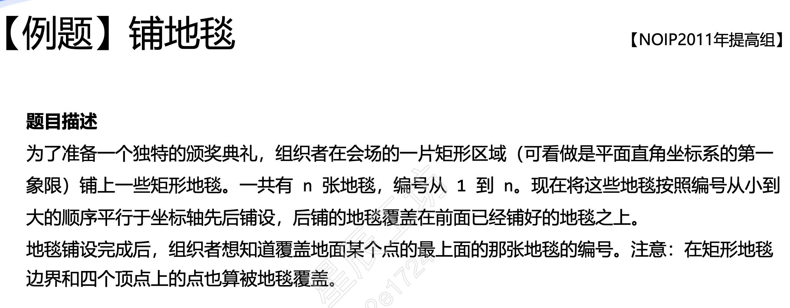

# 枚举算法
1. 确定枚举对象，范围和判断条件  
2. 逐一枚举可能的值，并验证每个解是否为可行的解  
3. 尽可能减少枚举的范围和对象数量，提高枚举算法的效率  

## 题目  
1. 铺地毯



* 解题思路：  
从最后一张地毯往前判断每一张地毯的范围内是否有该点
* 示例程序：  
```cpp
#include<iostream>
#include<vector>

using namespace std;

int main()
{
    int n, x, y;
    cin >> n;
    vector<int> a,b,g,k;
    int aa, bb, gg, kk;
    for(int i =0;i <n;++i)
    {
        cin >> aa >>bb >>gg >> kk;
        a.push_back(aa);
        b.push_back(bb);
        g.push_back(gg);
        k.push_back(kk);
    }
    cin >> x >> y;
    for(int i = n-1; i>=0;i--)
    {
        if(x >=a[i] && x <=a[i] +g[i] && y>= b[i] && y <b[i] + k[i])
        {
            cout << i+1 <<endl;
            return 0;
        }
    }
    cout << -1;
    return 0;
}
```